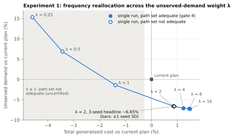
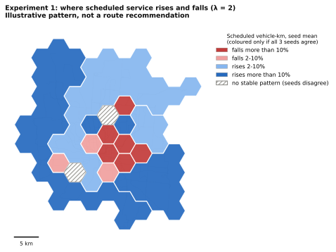
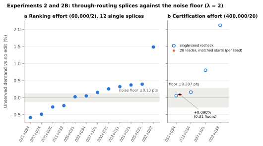
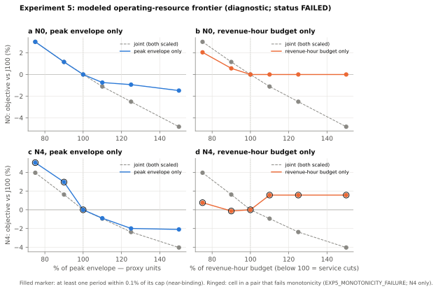
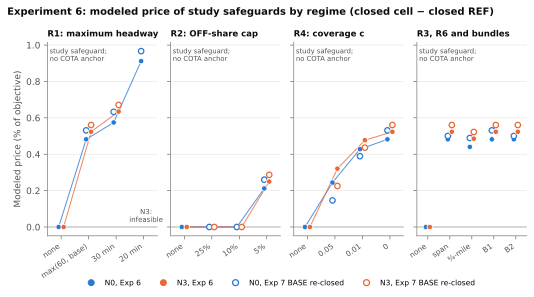
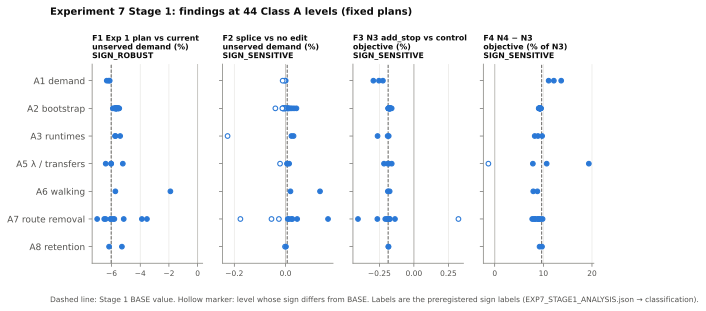
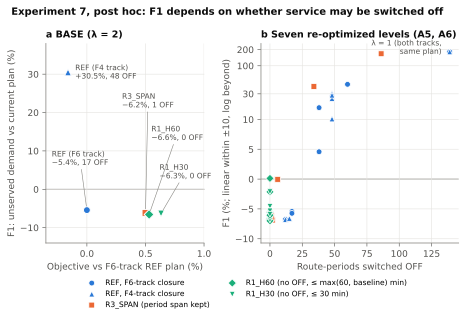
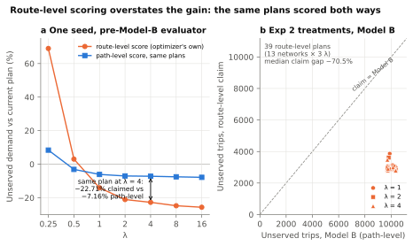

# How much can frequency, stops and geometry do for a mid-sized bus network? A convergence-controlled optimization study of the Central Ohio Transit Authority (COTA)

**Technical report: working-paper draft, 2026-10-05.**

**Author:** Ian Gregory. The human author is responsible for all content.
Generative AI (Anthropic's Claude) assisted with code, analysis, internal
review passes and drafting; AI systems are not authors or referees, and no
external human peer review has taken place (`docs/report/reviews/README.md`).
The project is independent of the Central Ohio Transit Authority (COTA) and is
not affiliated with or endorsed by COTA.

*Status of this draft.*

* Written from the frozen research record. The freeze tag `research-final`
  (commit `cd03af9c`) exists in the author's clone but is **not yet public**
  on GitHub; until it is, cite the commit hash
  (`docs/RELEASE_PROVENANCE.md`).
* Every number is transcribed from a named artifact, cited inline or in
  Appendix A. Numbers not indexed by registry v5 are labelled (run log,
  historical ablation, diagnostic files, closeout orientation figure, post hoc
  addendum).
* The automated claims check (`scripts/verify_report_claims.py`) covers the
  headline numbers. It does not yet cover every number, and the release rule
  "every number generated, never typed" is **not yet met**.
* **Figures.** The seven guideline figures, plus one added by amendment G2-a,
  are generated by `scripts/make_report_figures.py` from the artifacts each
  caption names, each with its CSV (`docs/report/figures/`,
  `FIGURES_MANIFEST.json` records input hashes). The older
  `outputs/figures` are pre-Model-B and are not used.
* **Not submission-ready.** Apache-2.0 code licensing is present (`LICENSE`;
  documentation, report and figures CC BY 4.0, `LICENSES/CC-BY-4.0.txt`).
  `CITATION.cff`, the canonical-envelope units sidecar and remaining
  source-terms metadata are pending.
* The abstract (≤ 250 words), highlights and keywords follow typical
  journal norms for this field; the target journal's limits are to be
  confirmed at submission.
* Authority order for Exp 7: `docs/process/HANDOFF.md` §1; where the closeout and
  `experiments/exp7/EXPERIMENT7_CLOSEOUT_ERRATA.md` conflict, the errata wins.
* Outline: §§1–11, Data and code availability, References, plus Appendices
  A–C (Appendix C covers only the Exp 7 amendment sequence); the guideline appendices (decision log →
  `docs/research-record/DISCOVERIES.md`, protocol amendments, superseded-artifact index,
  calibration register) are pending release work.

> **Model status**
>
> | item | status |
> |---|---|
> | Calibration | **Uncalibrated.** Every cost weight, the retention curve and the unserved-trip penalty are assumptions (`config/`). |
> | Aggregate fit / sanity check | The model serves 20,687 of the NTD-derived 30,949 linked-trip total (66.8%; `exp1_baseline_modelB.json`). This is a model-fit/sanity-check statistic, not an external validation target. The 33% "unserved" is a property of the model (retention curve, 600 m access radius, path enumeration, OD truncation), not of observed ridership. |
> | External validation | **None.** Route volume, stop pattern, transfer behaviour and trip length are unavailable for external validation (no observed boardings, transfers or trip-length data). |
> | Demand | **Commute spatial pattern only.** The NTD-derived total of 30,949 weekday linked trips (which includes non-work trips) is distributed over LEHD LODES 2022 home–work pairs; the spatial pattern of non-work travel is absent. The total assumes a 20% transfer rate (unobserved). |
> | Service basis | **Scheduled, not observed.** GTFS static. No reliability term. |
> | Fleet | **No modified plan has a physical vehicle count.** Resource caps are revenue vehicle-hours and a solver peak-concurrency proxy, not buses. |
> | Standing | **Not an operating plan. Not COTA-endorsed.** Independent research using public data. |

---

## Abstract

We study how frequency allocation and network-design interventions trade off modeled unserved demand and passenger generalized cost on the Central Ohio Transit Authority's (COTA) weekday bus network at approximately fixed modeled resources, scored by a λ-weighted objective. LEHD LODES commute flows, scaled to an NTD-derived weekday total, are assigned to enumerated paths on the GTFS schedule with an uncalibrated retention curve; the current timetable serves 67% of that total. Within the model, reallocating frequency within existing routes at fixed modeled resources served ~680 more modeled weekday trips (+3.3% served; ~2.2% of the 30,949 modeled weekday trips) and reduced modeled unserved demand by 6.65% (solver-seed SD 0.06 percentage points), while total generalized cost rose 0.88%. The gain stayed positive under all 44 pre-specified fixed-plan perturbations (−1.9% to −7.0% unserved). The best of 12 through-routing splices is slightly worse than no edit under matched starts; route mutations move the objective by at most 0.19%. N4, the best of the 200 promoted and certified greenfield candidates, was 8.5–9.7% worse than N3 on the modeled objective, under path and waiting models that fit it less well. On N0, study-safeguard constraints worsened the modeled objective by 0–0.91% (N3: 0–0.63%); these are study safeguards, not COTA policy. At λ = 2 in the OFF-permitting decision space, two independently closed fixed points 0.16% apart in objective give −5.4% and +30.5% changes in modeled unserved demand, so that objective does not identify unserved demand there. Methodologically, matched convergence, matched starts and common resource caps each changed conclusions.

**Highlights**

* Frequency reallocation served ~680 more modeled weekday trips at fixed hours
* The gain stayed positive under all 44 perturbations tested (316–970 trips)
* Best of 200 certified greenfield candidates was 8.5–9.7% worse than N3
* Unmatched convergence and solver starts produced a spurious 0.5% gain
* Self-drawn resource caps inverted 36.7% of pairwise network rankings

**Keywords:** transit network design; frequency setting; transit assignment; robustness analysis; computational experiments; Columbus, Ohio

---

## 1. Question and scope

**Summary of findings** (λ = 2 objective unless stated; every effect is in its
own model instance, §4.1; "certified" terms as defined in §4). The rows are not
one controlled experiment: model instances and metrics differ, so cross-lever
effect sizes are not formally comparable.

| lever | effect, with metric | status | main caveat |
|---|---|---|---|
| Frequency reallocation, geometry fixed (Exp 1) | ~680 more modeled weekday trips served (+3.3%); −6.65% modeled unserved demand (solver-seed SD 0.06 percentage points); −2.21% of the objective; total GC +0.88%; GC per served trip −2.34% | path-set adequate and seed-distinguishable for λ ≥ 2; sign kept at fixed plans across 44 pre-specified Class A levels (−1.9% to −7.0%) | No individual route's headway is identified (§5.1). Unserved demand is a model construct (33% unserved at the current plan). At λ = 2 in the OFF-permitting decision space the objective does not identify unserved demand (§6.2) |
| Through-routing splices (Exp 2 / 2B) | leader +0.090% unserved demand, +0.054% of the objective under matched starts: worse than no edit | not distinguishable from zero at certification effort (Exp 2B floor); single-splice harm verdicts are mostly ranking-effort (§5.2) | The 240-set sweep is discovery-stage; the 0.287-percentage-point floor is an incumbent-start replicate spread (§5.2) |
| Route mutation (Exp 3) | 29 seed-distinguishable improvements of 0.01–0.19% of the objective; leader adds a stop on route 010, −0.19% (model result; not a recommendation) | seed-distinguishable; the leader at 20 restarts only | Within its own Exp 7 sensitivity range; add_stop runtime cost rests on an unvalidated regression intercept (§5.3, §8) |
| Greenfield network design (Exp 4 / 4N / 4A) | N4, the best of the 200 promoted and certified greenfield candidates, is +8.55% to +9.66% of N3's objective (worse); the best of all 2,000 generated is not identified | firewall-admitted; single basin to closed | Path model fits N4 worse; cross-route common lines omitted; equal proxy budgets need not be equal fleets; leader not identified (§5.4) |
| Operating resources (Exp 5) | N0: cutting hours to 90% costs +0.57% of the objective; more peak proxy at fixed hours helps with diminishing returns | `EXP5_MONOTONICITY_FAILURE` (on N4); N0 monotone, informative | Start-basin dependence ≥ 1.70% on N4; the proxy is not a vehicle count (§5.5) |
| Study safeguards (Exp 6) | 0 to +0.91% of the objective on N0, 0 to +0.63% on N3; 20-min headway floor infeasible on N3 under the modeled envelope | block-local certified with basin closure | The zero prices are caps that do not bind at the pricing reference plan; against the best-known REF plan they would bind. Prices are basin-dependent at about 0.1–0.16 percentage points (§5.6) |

> Holding modeled operating resources approximately constant, how do frequency
> allocation and network-design interventions trade off modeled unserved demand
> and passenger generalized cost, and how much can the study's λ-weighted
> objective improve under those interventions?

An earlier framing asked how much passenger generalized travel cost could be
reduced. That did not describe the objective or the headline result (total
generalized cost rises 0.88% under the Exp 1 plan); it was corrected as a
framing change, with no number changed (`docs/REPORTING_CORRECTIONS.md`, C1).

Transfer timing (timetable synchronization) is outside this frequency-based
model, and stop consolidation is deferred (registry `exp3.limitations`). "Stop
structure" here means adding stops to existing routes.

The study is a **modeled** answer:

* It sizes what the current resource envelope makes possible under stated
  assumptions.
* It measures how much of that answer survives when the assumptions move.

It does not propose a timetable. Section 5.1 shows that the frequency optimum
is flat: plans differing on about 19% of route-periods score with a solver
seed spread (SD) of 0.064 percentage points. No individual route's headway is identified, and none is recommended
here (reporting rule 8).

Seven experiments ran in sequence. Each froze a contract before its
production run (`experiments/ACCEPTANCE.md`, the per-experiment contracts); analyses added
afterwards are marked post hoc (§6.0).

| # | question | status |
|---|---|---|
| 1 | Frequency redistribution, geometry fixed | Closed: path-set adequate and seed-distinguishable (λ ≥ 2) |
| 2 / 2B | Through-routing (splice) geometry, singly and in all feasible combinations | Closed: no supportable gain (leader not better than no edit at certification effort; 240-set sweep discovery-stage) |
| 3 | Route mutation over eight edit kinds | Closed: one seed-distinguishable leader (at 20 restarts) |
| 4 / 4N / 4A | Greenfield network design at scale; normalized rerun; original-question comparison | Closed: ordering superseded by 4N; greenfield worse (4A) |
| 5 | Modeled operating-resource frontier on two geometries | **Failed** its monotonicity gate (on N4 only); N0 results monotone (informative, not certified) |
| 6 | Modeled price of service-standard safeguards | Closed: block-local certified with basin closure |
| 7 | Robustness of findings F1–F6 to model assumptions | Closed: Stage 1 and Stage 2 complete |

### 1.1 Related work

**Network design and frequency setting.** The transit network design and
frequency-setting problems (TNDP, TNDFSP) are surveyed by Guihaire and Hao
(2008), Ibarra-Rojas et al. (2015) and Durán-Micco and Vansteenwegen (2022).
Cancela et al. (2015) give mathematical-programming formulations with user
waiting times and multiple line options. Classic heuristic network design is
Ceder and Wilson (1986). Frequency setting under a fleet constraint goes back to
Furth and Wilson (1981). The scale economy behind frequency reallocation,
waiting time falling with frequency, is Mohring (1972), the source of the
"square-root rule" invoked in D1. Variable-demand network design, in which
ridership responds to the network, is treated by Lee and Vuchic (2005). The
tension this study's λ and coverage safeguards encode, ridership against
coverage, is set out by Walker (2008).

**Assignment.** Frequency-based assignment with *common lines* lets a passenger
board whichever attractive line arrives first (Chriqui and Robillard, 1975).
*Optimal strategies* (hyperpath) assignment generalizes this to networks (Spiess
and Florian, 1989). This study does neither. It assigns all-or-nothing to the
cheapest of at most four RAPTOR-enumerated paths, and combines frequency only
across patterns of the same route (Model B; §3). Its known consequences are no
route-choice dispersion, no cross-route strategy, and dependence on the
enumerated path set (§3.0, §8.1).

**Computational experiments with heuristics.** Comparing heuristics at matched
effort, normalizing resource budgets and reporting controlled experiments rather
than competitive tables are established cautions (Barr et al., 1995; Hooker,
1995; Rardin and Uzsoy, 2001). Our methodological findings 2, 3, 5 and 7 (§7)
are instances of them, found the hard way in a transit setting.

**Model validation.** Standard travel-model practice separates calibration from
validation against observed aggregates (Cambridge Systematics, 2010). This model
is uncalibrated, and validation data are unavailable on all four dimensions
(status box).

**What is new here.** The contribution is not a new frequency-setting algorithm.
It is:

1. a harness that freezes contracts in the repository before production runs, admits only declared treatment
   differences (semantic firewall), certifies convergence and applies declared
   basin closure;
2. a sequence of negative and bounded results for one real mid-sized network
   under a common resource envelope;
3. a documented record of how such a harness misled itself, and the retractions
   that followed (§9).

## 2. Data and provenance

| input | source | validation |
|---|---|---|
| Schedule | COTA GTFS static, feed `2026-MAY-04-BB_20260630`; representative weekday 2026-05-26 | `validate_feed`: 0 errors, 0 warnings |
| Demand | LEHD LODES8 `oh_od_main_JT00_2022`: 4,640,957 block pairs → 317,706 block-group pairs → 823,915 jobs (LODES JT00 home–work pairs, block-group aggregated) | Restricted to transit-accessible pairs (24.7% of jobs), truncated to the top 20,000 pairs (64.9% of accessible jobs), then rescaled to an assumed **30,949** weekday linked transit trips. That total is derived from NTD as 38,694 weekday unlinked trips × 95.98% bus share ÷ 1.20, assuming a 20% transfer rate that is unobserved. Rescaling after truncation inflates each retained pair by about 1.54×. Six period shares are assumed, because LODES has no time dimension. Counts from the run log `docs/research-record/run-logs/verify.log` (not a canonical artifact). |
| Zones | 2020 Census block-group population-weighted centroids | — |
| System totals | FTA NTD 2024 agency profile, agency 50016, motorbus directly operated | The parser **refuses** unless it reproduces all 18 of the profile's printed ratios |
| Physical fleet (baseline only) | GTFS `block_id` reconstruction: **197** peak vehicles at 17:13, 284 blocks | NTD VOMS 198; nothing tuned. A check on the baseline schedule only; it says nothing about modified plans. |

Every input enters through an immutable registry: SHA-256 checksum, retrieval
timestamp and source record in `config/sources.yaml`. Raw data is re-fetched,
not committed. Model baseline revenue vehicle-hours reproduce the GTFS schedule
as an identity, asserted at run time to 1e-9.

## 3. Model

### 3.0 Problem statement

**Notation.**

| symbol | meaning |
|---|---|
| k ∈ K | route-period with baseline service (N0: \|K\| = 173 of 39 × 6 = 234) |
| h_k | headway (min); h_k^0 its baseline value |
| L | headway ladder {5, 6, 7.5, 10, 12, 15, 20, 24, 30, 40, 45, 60} (`config/constraints.yaml`) |
| (o,d) ∈ D | OD pairs, top 20,000; f_od their flow by period |
| Π_od | ≤ 4 RAPTOR-enumerated paths, ≤ 2 transfers |
| λ | weight on unserved demand; w_u = 60 min |

**Decisions.**

* Experiment 1: h_k ∈ L ∪ {h_k^0}, with h_k ≤ max(60, h_k^0). Baseline headways
  above 60 min are kept off-ladder (e.g. 65.45, 72, …, 240), and the 14
  peak-only express routes are locked as a class.
* Experiments 2–3: the Experiment 1 set on the edited network (no OFF).
* Experiments 4–7: the Experiment 1 set plus OFF (`frequency.build_ladders`
  with `allow_off=True`), subject to the active policy constraints R1–R6
  (`experiments/exp6/EXPERIMENT6_CONSTRAINT_CATALOG.md`).

**Waiting.** Expected wait for effective headway H (`config/assumptions.yaml →
waiting`):

(1) w(H) = H/2 if H ≤ 12; w(H) = 6 + 0.25·(H − 12) if H > 12.

A ride leg ℓ on pattern q of route-period k has effective headway
H_ℓ = h_k · m_ℓ.

* **Model A:** m_ℓ = n_dir(q)/n_pat(q).
* **Model B:** m_ℓ = 1 / Σ_{q′ ∈ Q(ℓ)} n_pat(q′)/n_dir(q′), where Q(ℓ) is the
  set of patterns of the *same route* that serve ℓ's boarding stop and then its
  alighting stop in that period (2), and n_pat, n_dir are the period's trips on
  the pattern and in its direction. With |Q(ℓ)| = 1, Model B reduces to Model A.

**Path and OD cost** (minutes; `config/cost_weights.yaml`):

(3) c_π(h) = 2·walk + 1·IVT + 2·w(H_first) + Σ_transfers [2·w(H_ℓ) + 10].

c_od(h) = min{min over π ∈ Π_od of c_π(h), c_od^walk}, where c_od^walk = 0 for
intrazonal pairs (origin zone = destination zone) and ∞ otherwise
(`pathset.py:246–250, 533`); c_od = ∞ only if Π_od is empty and the pair is
not intrazonal.

**Retention** (a discouragement proxy, not a mode-choice model):

(4) r(c) = 1 for c ≤ 60; 1 − 0.9·(c − 60)/150 for 60 < c < 210; 0.10 for
c ≥ 210.

**Objective:**

(5) min Z(h) = Σ_od f_od·r(c_od)·c_od + λ·w_u·U(h),

where U(h) = Σ_{c_od < ∞} f_od·(1 − r(c_od)) + Σ_{c_od = ∞} f_od is unserved
demand (discouraged + structural). Experiment 1 adds a crowding cost on
in-vehicle time; Experiments 2–7 do not.

**Resources.** With T_k the period length (min), d_k the number of directions,
ρ_k the mean one-way runtime (min) and layover ratio 0.15 (assumed;
`assumptions.yaml`):

(6) RVH(h) = Σ_k d_k·T_k·ρ_k / (60·h_k) ≤ 2,517.18

(7) Σ_{k ∈ p} C_k / h_k ≤ V_p for each period p, with C_k = 2·ρ_k·(1 + 0.15),

V = (85.28, 162.01, 159.17, 176.49, 140.19, 35.56) from early through owl
(EXP4N; Experiments 4N–7). In Experiment 1, V_p is the baseline plan's own
proxy value. OFF route-periods contribute zero to (6) and (7). ((6) is
`exp2.evaluate_array`: trips = d_k·T_k/h_k, vehicle-hours = Σ trips·ρ_k/60;
(7) is the frequency model's cycle/headway proxy, `frequency.py`.)

**Assignment, positioned.** Demand is assigned all-or-nothing to the cheapest
enumerated path. That is neither frequency-based optimal-strategy (hyperpath)
assignment (Spiess and Florian, 1989), nor cross-route common lines (Chriqui
and Robillard, 1975), nor schedule-based assignment. Frequencies combine only
across patterns of one route (Model B). Path diversity is limited by the number
of pricing scenarios, at one path per scenario, so the four-path cap does not
bind (Exp 4A, gate 4-9). The known consequences are no route-choice dispersion,
no cross-route strategy (§3.1, §8.1), and results conditional on the enumerated
path set (gate 4, D15).

### 3.1 Model components

**Network and decisions.**

* The decision unit is the route-period. N0, the existing geometry, has 39
  routes × 6 periods = 234 route-periods, of which 173 have baseline service.
  The other 61 are not decision variables: the model builds a route-period
  only where the feed has trips (`exp1.py:71–78`; the config flag
  `allow_new_service_in_empty_periods: false` states the same rule but is not
  read by code), so OFF means switching off a baseline-served route-period.
  Each served route-period takes one headway from a discrete ladder (5–60 min).
* **Experiment 1 rules:**
  * a route-period with baseline service keeps service;
  * no headway may exceed max(60 min, baseline);
  * 14 peak-only express routes are locked as a class (D4).
* **Experiments 4–7** use a certifier that may also switch route-periods OFF
  (`allow_off`), unless a policy cell forbids it.

**Path assignment.**

* RAPTOR enumerates up to 4 candidate paths per OD pair and period, with up to
  2 transfers, a 600 m access radius, a 400 m transfer-walk radius and
  80 m/min walking.
* Enumeration is widened by frequency scenarios until the improvable flow share
  converges (fixpoint, D6).
* Passengers take the cheapest enumerated path, all-or-nothing.
* A retention curve drops a share of trips whose generalized cost exceeds
  60 min, falling linearly to a floor of 0.10 at 210 min. Dropped trips are
  *unserved*.

**Waiting (Model B).**

* A ride leg is priced at the combined frequency of every same-route pattern
  that serves the boarding stop and then the alighting stop:
  mult = 1 / Σ_q (n_trips(q) / n_direction_trips(q)).
* Model A, the chosen pattern's own headway, is the one-pattern special case.
  It undervalues frequent trunk service and was retired as the evaluator (D10,
  D12).
* Cross-route common lines (Chriqui and Robillard, 1975; Spiess and Florian,
  1989) are not modeled. A diagnostic upper bound on the wait saving they would
  give *on legs already served* is 0.516% of GC on N0 (Exp 1 instance, am_peak
  and midday only), 1.16% on N3 and 12.47% on N4 (Exp 4A instance). Riders who
  would be retained by shorter waits are not included, so the effect on the
  objective is neither measured nor bounded. No experiment varied this (§6,
  R13).

**Generalized cost**, in in-vehicle-minute equivalents (`config/cost_weights.yaml`):

| component | weight |
|---|---|
| walking | 2.0 |
| waiting | 2.0 |
| in-vehicle time | 1.0 |
| transfer wait | 2.0 |
| per-transfer penalty | +10 min |

**Crowding** does not bind at the system level at the modeled demand: the
median peak-load-point bus is at 9% of capacity (D5). In Exp 4A one N3 am-peak
route-period exceeds the 60-passenger planning capacity (max load 68.3).
Crowding is priced only in Experiment 1; it is off in Experiments 2–7.

**Objective.** minimize GC + λ · w_unserved · unserved, with w_unserved = 60
min and λ = 2 unless stated.

* The objective has no operating-cost term; operating resources enter only as
  constraints (the envelope is a cap).

**The objective is not a welfare measure.** Per OD pair with flow f and least
cost c, the objective counts f·[r(c)·c + (1 − r(c))·λ·60], where r is the
retention curve (1 up to 60 min, falling linearly to 0.10 at 210 min). It is a
λ-weighted sum of served-trip generalized cost and lost trips, not consumer
surplus. Two consequences follow, both independent of experiment:

1. *Removing* an OD's last path lowers the objective whenever c > λ·60 (by
   f·r(c)·(c − λ·60)). That needs a decision space that can delete every path
   for an OD: OFF in Experiments 4–7, or geometry edits.
2. *Marginally worsening* an OD's service lowers the objective whenever c lies
   between (1/s + 60 + λ·60)/2 and 210 min, where s = 0.006 per minute is the
   retention slope. At λ = 2 that is c ∈ (173.3, 210) min; at λ = 1,
   c ∈ (143.3, 210); for λ ≥ 29/9 ≈ 3.222 the interval is empty. Experiment 1
   forbids OFF, so only this second channel is open to it.

Lower objective therefore does not always mean better service. The share of
baseline flow in the exposed cost band is not recorded in any artifact and is
not reported here.

* A served trip counts its full generalized cost c; a lost trip counts λ · 60.
  The removal channel above is how, below some λ, the optimizer drops
  hard-to-serve riders and spends the freed hours elsewhere (§6.2). An
  operating-cost term would not prevent this
  (`experiments/exp7/EXPERIMENT7_CLOSEOUT_ERRATA.md` E7).
* Experiment 1's frontier is certified only from λ = 2 upward. The λ ≤ 1 corner
  fails the path-set adequacy test on both waiting models (D15).

**Resource envelope.** Experiments 4N–7 use the EXP4N common envelope:
`outputs/exp4_normalized/COMMON_RESOURCE_ENVELOPE.json`, rounded digest
`3fd5241db44ca9da`, exact fingerprint `0b46d1abc9a80c80` in
`outputs/ENVELOPE_FINGERPRINT_V1.json`. It has two parts:

* 2,517.18 weekday revenue vehicle-hours;
* six per-period caps on the solver's peak-concurrency proxy (Σ cycle/headway).
  The caps are 85.28, 162.01, 159.17, 176.49, 140.19 and 35.56, from early
  through owl.

`outputs/CANONICAL_ENVELOPE.json` is a different artifact. It holds the
block-derived **physical** per-period vehicle counts of the existing schedule
(135–197), which apply to the baseline only.

The proxy is **not a vehicle count**:

* it reads 176.49 at the baseline PM peak, about 10% below the 197 physical
  vehicles, because it does not model interlining
  (`CANONICAL_ENVELOPE.json` → `NOT_THE_CAP`);
* the blocking instrument cannot certify any modified plan (§8).

All resource statements in this report are therefore in revenue vehicle-hours
or proxy units.

## 4. Harness

**Contracts and pre-specification.** From Experiment 2 onward, each experiment
froze, in a repository commit before its production run:

* a contract: digests of the code, envelope, candidate set and acceptance
  gates;
* its acceptance rules (`experiments/ACCEPTANCE.md`).

"Pre-specified" in this report means frozen in an author-controlled git commit
before the outcome it governs was inspected. Git establishes the temporal order;
it is not independent third-party registration, and no external registry (such
as OSF) was used. The freeze commits (committer dates, UTC):

| rule or design | frozen at | before |
|---|---|---|
| Exp 2/2B acceptance gates, incl. the NULL rule and floor | `2ac3b1dd`, 2026-08-29 | Stage C (`6ccfc09f`, 2026-08-30) |
| Exp 2B matched-start confirmation rule | `ddf86518`, 2026-08-31 (archival branch `exp3`) | first confirmation cell |
| Exp 3 Stage B escalation rule (§6) | `23bb99bd`, 2026-09-01 | first Stage B cell (`a833df28`) |
| Exp 4A contract | `16a0c86a`, 2026-09-28 | Δ43 run (`9a9a63ca`) |
| Exp 5 contract, monotonicity gate | `4a9bc6b5`, 2026-09-28 | first production cell (`48811f1c`) |
| Exp 7 Class A levels, sign labels, magnitude bands (amendment §13) | `b18c2f24`, 2026-09-29 | any Stage 1 evaluation |
| Exp 7 amendment §14: Stage 1 BASE reference, Stage 2 selection metric, adaptive definitions (contract `1263bedaebe6a45d`) | `4a2ba9f6`, 2026-09-29 | the Stage 1 production run and Stage 2; **not** before all outcomes: the same commit holds 13 smoke Stage 1 cells, and a λ = 1 smoke re-optimization (`48e96a0f`) preceded it |

Experiment 1's acceptance gates (`experiments/ACCEPTANCE.md`, `1a2b6e2d`, 2026-08-26)
were committed after a first exploratory Exp 1 run (`e792be6b`), so Exp 1 is
not described as pre-specified.

Amendments are separate, dated documents. Acceptance rules are not waived
after the fact. Analysis exclusions made after results were seen are labelled
post hoc (§6.0), as are Exp 3's two display-only analysis-code fixes
(`experiments/exp3/EXPERIMENT3_CLOSURE.md` §8). A failed gate is reported as a failure
(Experiment 5).

**Semantic comparison firewall** (`docs/ARCHITECTURE_FIREWALL.md`):

* Every field of an evaluation carries a semantic class: identity, opportunity,
  outcome or none.
* A treatment effect is computed only if the two runs differ in dimensions the
  contract explicitly permits. That is a whitelist, not a blacklist.

The firewall cannot prove that a permitted difference was actually applied.
D35 is a constraint that was hashed into identity but never reached scoring.

**Certification.**

* *Experiments 1–3:* a Gen1 exchange search with perturbation restarts at
  400,000 iterations.
  * 20 restarts, with three or five seeds.
  * Exp 3's pre-specified escalation (`23bb99bd`) used 40 restarts for 23 of its 29 certified
    verdicts.
* *Experiments 4–7:* an exact (8, 3)-block-local certifier
  (`src/cota_opt/exp4_certify.py`).
  * Route-period keys are partitioned into blocks of 8, rotating by 4 each
    round.
  * Each block is enumerated exhaustively over a 3-rung window: the current
    rung and one either side.
  * Rounds repeat until no block improves. The guarantee is (8, 3)-block-local
    optimality.
  * The round ceiling is 40 by module default (legacy Exp 4). The EXP4N, 4A,
    5, 6 and 7 contracts set it to 120. Convergence is mandatory.
* *Experiments 6–7* add a declared **basin closure**:
  * certified plans are transferred as anchors along a frozen nesting graph,
    and across levels;
  * re-certification continues until a fixed point;
  * a fixed point is not a global optimum.

**Three meanings of "certified".** This report keeps them apart:

* **Path-set adequate (Exp 1, gate 4):** improvable flow under the 0.67% line;
  holds for λ ≥ 2 (D15).
* **Seed-distinguishable:** |mean Δ| / SD > 3 over the stated seeds at the
  stated effort (Exp 3); or, for Exp 1 and 2B, effect against the seed spread
  or the pre-specified floor.
* **Block-local certified:** a converged (8, 3)-block-local optimum (Exp 4–7).
  It is a local-optimality certificate, not a statement about solver variance.

None is real-world significance (reporting rule 3). In prose, "certified"
always carries one of these meanings: §5's preamble states which applies in
each subsection, and in §6.1 the "certified" column means the value in each
experiment's own closeout. Artifact status strings (e.g.
`EXP6_POLICY_FRONTIER_CERTIFIED`) keep their recorded names.

**Reproducibility.** Order sentinels re-run cells in reversed order and must be
bit-exact. Runs checkpoint per cell and resume. Generations of methodology are
frozen (`docs/METHODOLOGY.md`), and a newer algorithm reopens an old result only on
evidence.

### 4.1 Model instances and their differences

| | Exp 1 | Exp 2 / 2B | Exp 3 | Exp 4N / 4A / 5 / 6 / 7 |
|---|---|---|---|---|
| solver | Gen1 exchange, 400,000 × 20, 3 seeds | Gen1; discovery 60,000/2/32, certification 400,000/20, 3 seeds | Gen1, 20 restarts (23 of 29 escalated to 40), 5 paired seeds | (8, 3)-block certifier, ≤ 120 rounds, greedy start (+ closure in Exp 6–7) |
| decision space | no OFF; h ≤ max(60, baseline); express lock | no OFF | no OFF | OFF allowed (`allow_off`) except where a policy cell forbids it |
| crowding | on | off | off | off |
| path set | frozen, 243,257 paths, widened to pass gate 4 | rebuilt per network | rebuilt per network | rebuilt per network per certify call (N0: 152,241) |
| headline metric | % unserved | % unserved vs 0.287-percentage-point floor | % objective, seed-distinguishability ratio > 3 | % objective |
| start policy | incumbent (no treatment arm) | incumbent (treatment-dependent, D27) → matched (`both`) for the leader | `both` | greedy + closure anchors |

Comparisons between levers are qualitative. The experiments differ in solver,
decision space, crowding, path set, start policy, metric and noise floor. The
model instance alone moves F1 from −6.65% (Exp 1) to −6.02% (Exp 6/7 Stage 1
BASE, §6.1). The Exp 2B null is judged against 0.287 percentage points of unserved demand,
which exceeds every certified Exp 3 effect on its own scale, so "no gain" and
"small gain" partly reflect different detection thresholds.

## 5. Results

All results are on the λ = 2 objective unless stated. "Certified" takes one of
the three meanings defined in §4: path-set adequate and seed-distinguishable in
§5.1, seed-distinguishable in §§5.2–5.3, block-local certified in §§5.4–5.6.
None means real-world significance (reporting rule 3).

**All levers on one metric (% of the λ = 2 objective, each in its own model
instance):**

| lever | effect, % of objective | instance / status |
|---|---|---|
| Frequency reallocation (Exp 1) | −2.21% | Exp 1 instance (crowding on, frozen 243,257-path set); computed (linear) from 3-seed component means; no seed SD |
| Through-routing leader (Exp 2B) | +0.054% | Exp 2B instance (crowding off); matched starts, 3 seeds (2 identical) |
| add_stop leader (Exp 3) | −0.187% | Exp 3 instance; 20 restarts; seed-distinguishable |
| Greenfield N4 vs N3 (Exp 4A / 6 / 7) | +8.55% to +9.66% | Exp 4A–7 instance; single basin to closed |
| Safeguards (Exp 6) | 0 to +0.91% (N0) | Exp 6 instance; closed |

The instances differ (§4.1); the ordering is qualitative.

### 5.1 Experiment 1: frequency redistribution (geometry fixed)

The headline is three seeds at 400,000 iterations × 20 restarts on one frozen
243,257-path set (`outputs/canonical/exp1_final.json`, commit `f1a05645`).

| quantity | change vs current plan | solver-seed SD (percentage points) |
|---|---|---|
| unserved demand | **−6.65%** | 0.06 |
| trips served | +3.30% | 0.03 |
| total generalized cost | +0.88% | 0.04 |
| generalized cost per served trip | −2.34% | 0.01 |
| objective (GC + 120·unserved) | **−2.21%** | not recorded per seed |

Objective row computed from `exp1_baseline_modelB.json → baseline_gc,
baseline_unserved` and `exp1_final.json → headline` means (linear); the λ = 2
frontier run gives −2.213%.

**In trips.** The three seed plans serve 677, 690 and 680 more modeled weekday
trips than the current plan (mean 682: +3.30% served, 2.2% of the 30,949
modeled trips; `seedcheck_modelB.jsonl → served_change_pct` ×
`exp1_baseline_modelB.json → baseline_served`). The seed SD in the table
measures search noise. **Solver-seed SD measures optimization variability
with data and assumptions fixed. It is not a confidence interval and does not
quantify real-world uncertainty;** §6 (perturbations) and §8 (limitations)
address that. Evaluated as fixed plans
in the Exp 6/7 model instance, where the gain at BASE is 628 trips, the 44
Class A perturbations give 316 trips (shorter walking radii, §10) to 970
(non-commute demand +100%, which doubles total demand); at the 41 levels that
keep total demand at 30,949, 316–760 (`outputs/exp7/stage1/evals/N0/*.json →
rows`).

* In modeled trips, at the λ = 2 frontier point, unserved demand falls from
  10,262 to 9,583 and served trips rise from 20,687 to 21,366 (of 30,949).
  (This is the single λ = 2 frontier run, −6.60%; the three-seed headline mean
  is −6.65%.) Unserved demand is a model construct: the current plan already
  leaves 33% of the NTD-anchored total unserved. In an earlier, pre-Model-B
  evaluation of the same baseline
  (`outputs/experiments/exp3_ablation_20260826T112047Z`, not canonical), 22% of
  baseline unserved demand had no path at all and 78% was lost through the
  retention curve. The split is not recorded for the certified instance.
* The λ = 2 frontier plan uses 2,516.65 of 2,517.18 revenue vehicle-hours
  (`exp1_final.json → frontier[λ=2].revenue_veh_hours`).
* The plan stays within the baseline's per-period peak-concurrency proxy. Its
  physical fleet requirement is **not** measured
  (`CANONICAL_RESULTS_v4.json → reporting_corrections`).

**The frontier across λ:**

| λ | unserved vs current plan (single run) | path-set adequate (gate 4)? |
|---|---|---|
| 0.25 | +15.31% | no (uncertified) |
| 0.5 | +6.85% | no (uncertified) |
| 1 | −1.42% | no (uncertified) |
| 2 | −6.60% | yes |
| 4 | −7.12% | yes |
| 8 | −7.25% | yes |
| 16 | −7.28% | yes |

Every row is a single run (λ = 2 included); the −6.65% headline is the
three-seed mean. Below λ = 2 the path set fails its adequacy test (D15).

**Figure 1.** Experiment 1 frontier: unserved demand against total generalized
cost, both relative to the current plan, for one λ = 2 frontier run per λ
(filled where the path set passes gate 4, λ ≥ 2; shaded region uncertified).
The diamond is the three-seed λ = 2 headline with ±1 seed SD in each direction.
Artifact `outputs/canonical/exp1_final.json` (`frontier`, `headline`), commit
`f1a05645`; network N0; evaluator Model B with crowding, frozen 243,257-path
set. Data: `figures/fig1_exp1_frontier.csv`.

**The aggregate is identified; the plan is not.**

* Independent seeds produce plans differing on 19.1% of the 173 route-periods
  (worst pair 19.7%), by a mean of 6.9 minutes, while their unserved-demand
  changes have an SD of 0.064 percentage points (range 0.12: −6.60, −6.72, −6.63%) (D17).
* The optimum is flat. Whether unmodeled operational constraints (clock-face
  headways, interlining, runcutting) can be met at little cost was not tested.
  The safeguards that were priced (Exp 6) cost up to 0.91% of the objective.

**Where service moves.** A pre-Model-B analysis found frequency moving from the
most frequent routes toward the 30–120-minute tier (D1). It is not re-verified
on the certified Model B plans, and is not a finding of this report (R16).
Figure 2 shows the aggregate pattern of the three certified Model B seeds under
an aggregation contract frozen before the map was drawn
(`config/change_map_aggregation.yaml`, commit `08a16b35`). Scheduled
vehicle-kilometres fall in the central units and rise in most outer units; 15
of 17 units have all three seeds agreeing on the direction. The map is
illustrative: it is an aggregate of plans that disagree on 19.1% of
route-periods, not a route recommendation.

**Figure 2.** Experiment 1 change pattern (λ = 2): change in scheduled revenue
vehicle-km per weekday by unit, seed mean, coloured only where all three
certified seeds agree on direction (2% threshold); hatched units disagree.
Units are a fixed 4 km hex grid merged until each has at least three routes and
no route carries more than half the unit's change; bands, never headways.
*Illustrative pattern, not a route recommendation.* Plans:
`outputs/seedcheck_modelB.jsonl` (cells `seed2026082{5,6,7}|lam2.0|r2`), commit
`f1a05645`; current plan and route shapes from the registered GTFS feed via
`cota_opt.baseline`; network N0; evaluator Model B. Scheduled estimates, not
operated service. Two untested assumptions bear on this pattern more than on
F1's sign: the retention knee (60 min, never varied) and cross-route common
lines, which the waiting model omits where routes overlap downtown (§8.1).
Data: `figures/fig2_exp1_change_map.csv`.

**Returns in λ plateau.** Past λ = 4, the last 0.15 percentage points of unserved-demand
reduction (−7.12% → −7.28%) cost 0.25 percentage points of total generalized cost
(+1.24% → +1.49%; `exp1_final.json → frontier[λ].gc_change_pct`; single runs). D2
records this plateau. It holds on the path-set-adequate Model B frontier,
though the λ = 8 → 16 step (0.03 percentage points) is within the 0.06-percentage-point seed SD
measured at λ = 2.

### 5.2 Experiments 2 and 2B: through-routing geometry

Twelve splice candidates (two routes merged at a shared stop) were screened
from 60 and evaluated with frequency re-optimized on each network
(`experiments/exp2/EXPERIMENT2_CLOSEOUT.md`).

* **Singles.** At ranking effort (60,000/2/32, discovery stage), six of the
  twelve single splices exceeded the ranking-effort unserved-demand floor (0.13
  percentage points) in the harmful direction. Only four singles were re-run
  at certification effort (400,000/20, one seed): two (002+033, 007+101)
  exceeded the 0.287-percentage-point floor and two (011+034, 033+034) landed
  inside it (+0.060%, +0.160%). None exceeded a floor in the beneficial
  direction at certification effort. These runs used incumbent starts, and
  matched-start confirmation was performed for the Exp 2B leader only, so the
  harm magnitudes are not re-sized here. (`experiments/exp2/EXPERIMENT2_CLOSEOUT.md` describes
  all six as certified at 400,000/20; the artifacts hold only these four,
  `experiments/exp2/EXPERIMENT2_CLOSEOUT_ERRATA.md` E1.)
* **Combinations (2B), discovery stage:** all 240 structurally feasible subsets
  were solved at discovery effort (60,000/2/32). This exhaustive sweep is
  discovery-stage under gate 12: it orders sets and does not size effects. It
  found that:
  * none of the 227 multi-edit sets beats the best single;
  * at λ ≥ 2 all 227 *substitute*, delivering less than their members promised
    separately.
* **The leader at certification effort (400,000/20/0, three seeds).**
  * Re-solved with matched starts (`starts="both"`), `splice|011|034|WESHIGW`
    is **worse than no edit**: **+0.090% unserved demand, +0.054% of the
    objective**, positive at every seed. Two of the three seeds are
    bit-identical.
  * That is 0.31 of the 0.287-percentage-point floor Exp 2B judges against (effect ÷
    floor), so the pre-specified verdict is NULL
    (`outputs/exp2b_certification.json → _confirmation`; D31).
  * The originally recorded +0.0065% came from an incumbent-start run in which
    the splice silently fell back to a greedy build (D27). It is superseded for
    quantitative interpretation (`outputs/superseded/exp2b_certification.superseded.json`).
* **Floor provenance.** The 0.287-percentage-point floor is the spread of three
  incumbent-start zero-edit replicates (9,749.1–9,765.1 unserved; D24). Under
  matched starts the control's spread is about 0.009 percentage points (D32). Replicate
  spread bounds solver variance, not solver error (D32–D33). The floor is
  therefore the pre-specified judging threshold, not a measured materiality
  bound.
* **Other weights.** At λ = 1 and λ = 4 (one seed each, discovery effort, no
  floor), the same single edit leads and no multi-edit set beats it (D25). No
  headline is drawn at those weights.

The mechanism is the shared envelope. A merged line is longer, so hours that
were buying frequency go into running it (D20, D26).

**Figure 3.** Through-routing splices against the noise floor (λ = 2).
(a) The 12 single splices at ranking effort (60,000/2), with the ±0.13-percentage-point
floor. (b) The four rechecked at certification effort (400,000/20; one seed,
mixed starts per D27), with the ±0.287-percentage-point floor, and the Exp 2B leader under
matched starts (per seed and mean, +0.090%, 0.31 floors). Values in (a) and the
open markers in (b) used incumbent or greedy starts chosen by the treatment
(D27). Artifacts `outputs/exp2_summary.json` (`singles`, `recheck_D19`),
`outputs/exp2b_certification.json → _confirmation`,
`outputs/exp2b_confirmation.json` (contract `7157ce1de9373420`); network N0;
evaluator Model B. Data: `figures/fig3_exp2_geometry_null.csv`.

### 5.3 Experiment 3: route mutation

84 census states across eight edit kinds went through Stage A. 39 were promoted
and 30 certified at Stage B (20 restarts). **29 remain certified** after a
pre-specified escalation (40 restarts). Source: `experiments/exp3/EXPERIMENT3_CLOSURE.md`, tag
`exp3-final-v1` (in the project's local clone, not yet pushed; see Data and code
availability).

| leader | effect | stability |
|---|---|---|
| `add_stop-010#22c4c35ac5b2` (model result; not a recommendation) | **−0.18657%** of the objective | \|mean Δ\| / SD = 78.6 (sample SD over five paired seeds; SD = 0.0024% of the objective) |

* The leader is distinguishable from all 28 other certified candidates **at 20
  restarts**. Registry regime caveat, quoted verbatim as the registry requires:
  "The certified set is NOT uniform in solver effort. 23 of the 29 carry
  40-restart verdicts; 6 -- every state section 6 never triggered on, the leader
  among them -- carry 20-restart verdicts, because section 6 escalates what is
  unresolved or failing and that is by construction the smaller margins. All 28
  of the leader's pairwise comparisons are at 20 restarts and the best margin
  confirmed at 40 restarts is 2.33x smaller. Phase 5b would have closed this and
  was abandoned with zero cells completed."
  (`CANONICAL_RESULTS_v5.json → experiments.exp3.regime_caveat`.) The leader
  therefore leads on the softer measurement (§7, finding 2).
* The mechanism is not established.
* N3, the network Experiments 4A–7 carry forward, is N0 plus this edit. To fit
  the EXP4N envelope, its base plan trims route 001 in five periods (e.g.
  am_peak 15 → 20 min; `outputs/exp6/d35/N3.json →
  base_plan_trims_to_fit_envelope`).
* Experiment 7 places the effect within its own sensitivity range, so it is
  reported as **within model uncertainty**.

### 5.4 Experiment 4: greenfield network design

A proposal generator produced 2,000 candidate networks. Under discovery-score
ranking, 200 were promoted and certified by the exact certifier.

* **The legacy ranking is superseded.** It resolved each candidate's peak cap
  against that candidate's own baseline plan, so each was optimized inside a
  budget it drew for itself.
* **EXP4N** re-certified all 200 under one common envelope (`src/cota_opt`
  byte-identical):

| | value |
|---|---|
| leader | `35e351133d6f` at 3,223,885.9475 (legacy rank 154) |
| margin to second | 0.387006% |
| legacy leader | now rank **185 of 200** |
| Spearman (legacy vs normalized) | +0.3566 |
| pairwise orderings inverted | 7,296 of 19,900 (36.7%) |

  (`experiments/exp4/EXPERIMENT4_NORMALIZED_CLOSEOUT.md`)
* **Experiment 4A asked the original question under the same contract:** does
  N4, the best of the 200 promoted and certified greenfield candidates, beat the
  Experiment 3 redesign (N3)? (The best of all 2,000 generated candidates is
  not identified.)
  * **No, in every measurement.** obj(N4) − obj(N3) at λ = 2:

    | comparison | Δ, % of N3's objective | status |
    |---|---|---|
    | Exp 4A, one start basin per network | **+9.66%** | firewall-admitted; contract pre-specified at `16a0c86a` |
    | Exp 6, best-known N4 vs closed N3 REF | +9.28% | orientation only, not firewall-admitted |
    | Exp 7 Stage 2 BASE, closure on both sides | +8.55% | firewall-admitted |

    The 1.1-percentage-point spread is start-basin dependence.
  * **Conditions.** The path model fits N4 markedly worse: 8.7–34.8% of flow
    improvable on N4 vs 1.0–3.7% on N3, against Exp 1's 0.67% adequacy line.
    Its omission-corrected Δ43 is +7.87% and is **not certified**. The waiting
    model omits cross-route common lines: the served-leg wait-saving bound is
    12.47% of GC on N4 vs 1.16% on N3. Both biases run against N4. Crediting N4
    with its whole common-lines bound and N3 with none (107,248 min; 93,301 min
    net of both bounds) still leaves Δ43 (283,973 min) positive, but
    retained-rider effects are not measured
    (`experiments/exp4/EXPERIMENT4_ORIGINAL_QUESTION_ADDENDUM.md` §5; registry `exp4a.caveats`).
    The addendum attaches its rounded 93,300 to the N4-only case; that figure
    is the net of both bounds.
  * **Resources.** Both networks share the EXP4N proxy envelope, not a common
    fleet. The proxy reads 176.49 against 197 physical vehicles on N0, and the
    corresponding ratio for N4 is unknown, so equal proxy budgets may be unequal
    fleets in either direction.
  * **The leader is not identified.** EXP4N's first-to-second margin (0.387%)
    is smaller than the N4 start-basin residual measured in Exp 5 (≥ 1.70%).
    Apart from the one audited proposal (discovery rank 237, below), nothing
    is known about the 1,800 proposals the promotion cap excluded (registry
    `exp4.limitations`).
  * N4 stays worse at every fixed-plan λ above 1.087.
  * Single-basin diagnostic; descriptive only; not a finding: in the
    OFF-permitting Exp 4A instance N3 serves 53.1% and N4 36.3% of the 30,949
    modeled trips (`diag_N3.json`, `diag_N4.json` → `totals`). Served demand is basin-dependent
    there (§6.2).
* **The promotion cap was invalid.** An out-of-band audit found an excluded
  proposal (discovery rank 237) that certifies 0.0147% better than the legacy
  leader. That comparison was made under the legacy per-candidate envelope.
  * Discovery scores were close to a constant plus noise in the measured
    region (D36: discovery's ordering was inverted relative to exact
    objectives; D38: discovery scores are nearly flat).

### 5.5 Experiment 5: modeled operating-resource frontier

Two resource axes were run: revenue vehicle-hours, and the solver's
peak-concurrency proxy. They were scaled from 75% to 150% in three arms (joint,
hours only, peak only), giving 16 cells on each of N0 and N4. Cells are named
J, H or P (joint / hours only / peak only) with a suffix giving the scale as a
percentage of the EXP4N envelope (e.g. J100 is the envelope itself).

* **Status: `EXP5_MONOTONICITY_FAILURE`.** On N4, 12 of 99 nested pairs regress
  by up to 1.70%: a looser budget certified a worse plan.
  * The cause is start-basin dependence of the block certifier (D39).
  * The residual is at least 1.70% on N4, about 4.4× EXP4N's
    first-to-second margin.
* **N0, informative though not certified as an experiment:** all 99 pairs are
  monotone.
  * Both axes bind at today's levels.
  * Above 100%, only the peak proxy binds: extra hours alone change nothing.
  * Cutting hours costs +0.57% (to 90%) and +2.05% (to 75%) of the objective.
  * Adding peak-proxy capacity with hours fixed helps, with diminishing
    returns: −0.74%, −0.94% and −1.48% at 110%, 125% and 150%.
* **N4 is worse than N0 at all 16 cells**, by 8.07–11.59% of N0's objective at
  the same cell
  (`experiments/exp5/EXPERIMENT5_CLOSEOUT.md`).

**Figure 4.** Experiment 5 resource curves: objective relative to J100 against
the peak-concurrency proxy level (left; proxy units, not vehicles) and the
revenue-hour budget (right; below 100% is a service cut), with the joint arm
dashed for reference. Filled markers have at least one period within 0.1% of
its cap; ringed markers belong to a pair that fails monotonicity (N4 only).
Status `EXP5_MONOTONICITY_FAILURE`: diagnostic, not certified. Artifact
`outputs/exp5/EXP5_ANALYSIS.json → frontier`, contract `395ee3c960f51935`;
networks N0, N4; Exp 6 model instance, block certifier. Data:
`figures/fig4_exp5_resource_curve.csv`.

### 5.6 Experiment 6: modeled price of service-standard safeguards

Safeguards were imposed one at a time on N0 and N3, with basin closure
(`experiments/exp6/EXPERIMENT6_CLOSEOUT.md`). Every regime is a **study safeguard**: none has a
documented COTA numeric anchor, so none is COTA policy or a Title VI
determination.

**Modeled price** (closed cell − closed reference, % of objective). Price
differences between basins are in percentage points of the objective.

| safeguard | N0 | N3 | Exp 7 Stage 2 BASE re-closed (N0 / N3) |
|---|---|---|---|
| OFF-share cap 25% / 10% | 0 (non-binding) | 0 | 0 / 0 |
| OFF-share cap 5% | +0.212% | +0.250% | +0.260% / +0.287% |
| coverage, c = 0.05 / 0.01 | +0.244% / +0.428% | +0.321% / +0.477% | c = 0.05: +0.146% / +0.225%; c = 0.01: +0.389% / +0.436% |
| ¾-mile area preservation | +0.440% | +0.485% | +0.489% / +0.522% |
| 60-min headway floor (also span, coverage c = 0, both bundles) | +0.482% | +0.524% | +0.531% / +0.561% (R3_SPAN and B2 +0.500% on N0) |
| 30-min headway floor | +0.575% | +0.634% | +0.633% / +0.671% |
| 20-min headway floor | +0.912% | **infeasible under the modeled envelope** | +0.967% / infeasible¹ |

**Figure 5.** Modeled price of each study safeguard against its constraint
level, one panel per regime, on N0 and N3: Experiment 6 closed prices (filled)
and the same cells re-closed at Exp 7 BASE (open). None of these regimes has a
documented COTA numeric anchor; all are study safeguards, not COTA policy or a
legal determination. N3 at a 20-minute maximum headway has an empty feasible
set. Artifacts `outputs/exp6/EXP6_ANALYSIS.json → firewall.policy`
(`outputs/exp6/EXP6_CONTRACT.json`) and `outputs/exp7/EXP7_ANALYSIS.json →
f6_prices` (contract `1263bedaebe6a45d`); Exp 6 model instance, block
certifier. Data: `figures/fig5_exp6_policy_frontiers.csv`.

¹ `INFEASIBLE_UNDER_ENVELOPE` proven at the levels where it was evaluated
(`EXP7_CLOSEOUT_TABLE.json → n3_r1_h20_feasibility`): BASE, A3_RT110, A3_RT120
and A3_RTNOISE. At A7_RM01–A7_RM10 it is `INFEASIBILITY_NOT_PROVEN`.

Re-closing the same cells at BASE in Exp 7 (same model; closure now with
cross-level anchors) moved each price by −0.10 to +0.06 percentage points and
reversed the order of coverage c = 0.05 and OFF-share 5% on both networks. The
Exp 7 pricing reference is itself 0.16% worse in objective than the best-known
REF plan (F4 track, 48 route-periods OFF). Against that plan every price would
be about 0.16 percentage points higher, and the 25% and 10% OFF-share caps would bind.
Exp 6 prices are therefore basin-dependent at the 0.1-percentage-point scale (post hoc
comparison; `EXP7_ANALYSIS.json → f6_prices`,
`EXP7_F1_DECISION_SPACE.json → rows[BASE].ref_f4_track`).

* **Closure mattered.** Greedy-only prices differed from closure-adjusted ones
  by −0.162 to +0.124 percentage points. They included two impossible negative
  prices.
* **The objective is flat.** Closure moved both unconstrained references
  0.13–0.16% in objective to plans serving about 4,600 more trips (+28%), at
  about 45% more generalized cost. Served-trip and GC figures from any
  single-basin run are therefore basin-dependent.
* **N3 vs N0:** N3 is better than N0 in all 13 comparable cells, by 0.15–0.23%.

## 6. Robustness: Experiment 7

50 levels were declared besides BASE: 47 run, and 3 not run (A4 ×2 and the
B2 objective). The 47 run levels (44 Class A in seven dimensions, 1 Class B,
2 additional) plus BASE were run on four network variants (N0, N3, N4, N0S):
4 × 48 = 192 evaluation cells. Declared but not run: A4 reliability (2 levels,
UNIMPLEMENTED) and the B2 jobs-accessibility objective (UNTESTED). Two further
additional items, path-width/scenario count (DROPPED as inert) and period tilt
(NOT INCLUDED), were not included. Only Class A levels label findings:

| dimension | what it perturbs |
|---|---|
| A1 | Non-commute trips *added on top of* the NTD-anchored total at 25/50/100% of commute volume (as issued). Total modeled demand rises 25–100%, so A1 perturbs volume as well as pattern; gravity form, commute OD pairs only; crowding not modeled (operationalized 29 Sep) |
| A2 | 20 LODES bootstrap draws |
| A3 | runtime ×1.1, ×1.2, and per-link lognormal noise (median \|error\| 20.5%), envelope fixed |
| A4 | reliability: **UNIMPLEMENTED** |
| A5 | λ = 1 and 4; transfer penalty 5 and 20 min |
| A6 | walk speed 68 m/min; access 450 m with transfer walk 300 m (bundled; operationalized 29 Sep) |
| A7 | remove each of the 10 busiest routes, resources kept in the envelope |
| A8 | retention floor point (`cost_retention_zero_min`) 150 min; floor 0 (amendment 29 Sep; `full_min` not varied) |

It ran in two stages (`experiments/exp7/EXPERIMENT7_CLOSEOUT.md`):

* **Stage 1:** 60 frozen solutions from Experiments 1–6, including the N0
  current plan (59 evaluable), evaluated unchanged on four network variants at
  every level: 192 cells, all complete.
* **Stage 2:** re-optimization with basin closure in the two dimensions a
  pre-specified metric selected from Stage 1, namely A5 (objective weights)
  and A6 (walking).
  * Five closures reached their fixed points.
  * 4/4 sentinels were bit-exact.
  * 0 of 840 monotonicity violations.
  * Every reported comparison was firewall-admitted.

**Class B and additional levels** (reported, never label findings;
`EXP7_CLOSEOUT_TABLE.json → rows[].class_b_and_additional`):

| level | F1 | F4 (N4 − N3) |
|---|---|---|
| B1_COMMONLINES: Model A (per-pattern headway) waiting, **not** cross-route common lines (Class B; model disagreement) | −5.99% | +7.86% |
| X_TOPK40K wider OD coverage (additional) | −5.49% | +8.82% |
| X_ROUNDS4 more RAPTOR rounds (additional) | −6.03% | +9.67% |

The as-issued Class B item "common-lines or hyperpath assignment" was not
implemented. No cross-route evaluator exists in `src/cota_opt`; `hyperpath.py`
computes only a diagnostic bound. The level named `B1_COMMONLINES` ran the
retired Model A evaluator (`common_lines = "pattern"`, `EXP7_LEVELS.json`;
Stage 1 `evaluator_checks`). It therefore measures Model A vs Model B
disagreement, which *raises* modeled waits (N0 baseline unserved 10,959 vs
10,424 at BASE). It is not a test of the cross-route omission, which runs the
other way. Every Exp 7 finding remains conditional on the same-route (Model B)
waiting model (errata E16; R13). (The Exp 6 safeguard bundle also called "B1"
is unrelated; see Glossary.)

### 6.0 What was pre-specified and what is post hoc

| statement | status | where frozen |
|---|---|---|
| Class A levels; Stage 1 sign labels and magnitude bands | pre-specified before any Stage 1 evaluation | amendment §13, `b18c2f24` |
| Stage 1 BASE reference; Stage 2 selection metric; F1/F4/F6/AF1 adaptive definitions | pre-specified before the production runs, frozen with smoke outcomes (§4) | amendment §14, contract `1263bedaebe6a45d`, `4a2ba9f6` |
| Level settings | 42 as issued 23 Sep (A1 and A6_MAXWALK75 operationalized 29 Sep); A8 amendment 29 Sep; 2 additional; 1 Class B | `EXP7_LEVELS.json → levels[].provenance` |
| F3/AF1 labels excluding A7_RM04/RM05 | added at closeout (post hoc flag) | `scripts/exp7_closeout.py` |
| F2 not-applicable exclusion | corrected at closeout | `scripts/exp7_closeout.py` |
| F1 under R1_H60/R1_H30/R3_SPAN; second REF fixed point | post hoc | `experiments/exp7/EXPERIMENT7_F1_ADDENDUM.md`, `EXP7_F1_DECISION_SPACE.json` (pre-specified: false) |
| λ = 1 and shedding mechanism tables (closeout §5.2); errata E7–E8 analyses | post hoc diagnostic | closeout §5.2, errata |

SIGN_ROBUST and the bands are descriptive labels across 44 Class A levels, 20 of
them bootstrap draws. They are not statistical tests, and dimensions with more
levels have more chances to register a sign event.

### 6.1 Findings table

Stability words follow the pre-specified bands. Worst bands are against
BASE.

| finding | certified | Stage 1 (fixed plans): sign / range / worst | Stage 2 (re-optimized) |
|---|---|---|---|
| **F1** frequency: unserved vs current plan | −6.65% | Stage 1 BASE −6.02% (Exp 6 model instance, no crowding); **SIGN_ROBUST**; −6.998 to −1.897%; worst A6_MAXWALK75 (68.5%); Highly sensitive (A6) | Pre-specified (may switch service OFF): SIGN_SENSITIVE, −6.8% to +182%, worst band Highly sensitive; **basin-dependent, not identified** (§6.2). Post hoc, in the closest cell to Experiment 1's rules (R1_H60): −2.1% to −7.0% at every λ ≥ 2 level re-optimized, +0.12% at λ = 1 (Exp 6 model instance and block certifier; one closure per cell; at five of seven levels closure did not improve the initial solve) |
| **F2** splice null | +0.090% unserved (matched starts; superseded record +0.0065%) | Pre-specified label SIGN_SENSITIVE (range −0.226 to +0.166%; worst A3_RTNOISE; Highly sensitive (all)). The effect stays within a few tenths of a percent of zero, and the null test against the Exp 2B floor holds at every applicable level. Stage 1 evaluates the incumbent-start Exp 2B control plans against the splice plan (BASE +0.0065%), not matched-start plans (errata E17). | not re-optimized |
| **F3** add_stop leader | −0.187% | SIGN_SENSITIVE via the rank-mismatched A7_RM05 only; SIGN_ROBUST without it; range −0.41 to +0.32%; Highly sensitive (A1, A7) | not re-optimized |
| **F4** N4 − N3 | +9.66% (single basin; +8.55% closed, Stage 2 BASE) | SIGN_SENSITIVE (flip only at λ = 1); −1.31 to +19.35%; Highly sensitive (A5) | +6.8% to +30.8% at every λ ≥ 2 level; −0.98% at λ = 1; worst band Highly sensitive |
| **F5** resource marginals | — | sign changes only at λ = 1; magnitudes highly sensitive to λ | not re-optimized |
| **F6** safeguard prices | 0 to +0.91% | N0: 11 of 13 cells SIGN_ROBUST (5 of 7 distinct non-zero plans; R2_S25/S10 are zero at every level). N3: 5 of 12 (3 of 6 distinct); the six λ = 4 flips are to between −0.007% and −0.010%. N0 R4_C05 and R4_C01 and N3 R6_ADA move by more than their own size and change sign: within model uncertainty (rule 3). | non-negative everywhere (enforced: a negative price blocks certification); ranking unchanged at transfer ×0.5; the R2 OFF-share caps (25%, 10%) become binding at λ = 1, transfer ×2 and walking levels. BASE re-closure moved Exp 6 prices by −0.10 to +0.06 percentage points (§5.6). |
| **AF1** N3 − N0 at matched policy | Exp 6 closed: −0.23% | SIGN_SENSITIVE via A7_RM05 in all 13 cells; excluding the rank-mismatched A7 levels, 10 of 13 SIGN_ROBUST (R4_C05, R4_C01, R6_ADA remain SIGN_SENSITIVE) | N3 better by 0.16–0.31% (F6 track) and 0.16–0.18% (independent F4 track, REF only) at every λ ≥ 2 level; the tracks differ by up to 0.15 percentage points, the same order as the effect (within model uncertainty); tie at λ = 1; worst band Highly sensitive |

Certified values come from each experiment's own model instance; Stage 1 BASE
is the classification reference (amendment §14.1). F1, F2, F3 and AF1 are on
N0/N3; F4 is N4 − N3. Magnitude bands are relative to Stage 1 BASE (−6.02%),
not the certified −6.65% (amendment §14.1, frozen at `4a2ba9f6` after the
smoke BASE values existed; pre-specified for the production run only).

Stage 1 evaluates the three certified Exp 1 plans in the Exp 6 model instance
(crowding off, per-network path set). There the current plan leaves 10,424
trips unserved, against 10,262 in the Exp 1 instance. The seed plans give
−5.94 / −6.16 / −5.98%, against −6.60 / −6.72 / −6.63% (closeout §4.1).

**Figure 6.** Experiment 7 Stage 1: F1–F4 at each Class A level, grouped by
dimension (fixed plans). Dashed line: BASE. Open markers: levels whose sign
differs from BASE. Panel labels are the pre-specified sign labels; magnitude
wording follows the pre-specified bands (§6.1 table). Artifact
`outputs/exp7/stage1/EXP7_STAGE1_ANALYSIS.json` (`values`, `classification`),
contract `1263bedaebe6a45d`; networks N0, N3, N4; Exp 6 model instance. Data:
`figures/fig6_exp7_robustness.csv`.

### 6.2 The objective's boundary

**At λ = 2, unserved demand is not identified in the OFF-permitting decision
space.** The N0 REF cell at the base assumptions (λ = 2) was closed
independently on two Stage 2 tracks:

| track | objective | F1 | route-periods OFF |
|---|---|---|---|
| F6 | 2,940,186 | −5.43% | 17 |
| F4 | 2,935,446 (0.161% better) | **+30.5%** | 48 |

Both are certified fixed points. This is Experiment 6's flat objective,
appearing directly in F1. Plans a fraction of a percent apart in objective
differ by tens of percent in unserved demand. The pre-specified F1 adaptive
values are therefore basin-dependent
(`outputs/exp7/EXP7_F1_DECISION_SPACE.json`, `experiments/exp7/EXPERIMENT7_CLOSEOUT_ERRATA.md`
E3).

**Figure 7.** Post hoc, not pre-specified. (a) At BASE, the two certified REF
fixed points differ by 0.16% in objective and by 36 percentage points in F1, while the
cells that keep (nearly) all service on — R1_H60 and R1_H30 with none OFF,
R3_SPAN with one — cost 0.50–0.63% of objective and sit near the fixed-plan F1.
(b) F1 against route-periods switched OFF at all seven re-optimized levels
(symmetric-log axis). Every positive REF value has 38 or more route-periods
OFF; R1_H60 at λ = 1 (+0.12%, none OFF) is a near-tie. Artifact `outputs/exp7/EXP7_F1_DECISION_SPACE.json` (sha256
`0d5e3da7…`; not in registry v5), from closure records under contract
`1263bedaebe6a45d`; network N0; Exp 6 model instance, block certifier. Data:
`figures/fig7_exp7_f1_decision_space.csv`.

**At λ = 1 the network nearly empties.** One basin of the flat λ = 2 objective
is shown for comparison:

| | N0 at BASE (F6-track basin) | N0 at λ = 1 |
|---|---|---|
| revenue vehicle-hours | 2,516 | 557 |
| route-periods OFF | 17 | 139 |
| modeled trips served (of 30,949) | 21,091 | 1,583 |
| generalized cost (in-vehicle-minute equivalents per weekday) | 1,757,243 | 69,305 |
| unserved demand | 9,858 | 29,366 |

* At λ = 1 an unserved trip costs 60 while a served trip averages 83–86 GC,
  so removing most service lowers the objective. At λ = 2 only trips above
  120 min of GC are exposed.
* Post hoc (errata E7): doubling the transfer penalty, or adding walking
  friction, tips the same trade more gently. Hours stay fully used, but the
  re-optimized plan (F6-track basin) serves fewer trips than the current plan
  at the same level:

| level (modeled trips served) | re-optimized plan | current plan |
|---|---|---|
| transfer penalty ×2 | 14,263 | 19,450 |
| slower walking | 18,324 | 20,118 |
| shorter walking radii | 13,537 | 14,301 |

  At the shorter radii, most of the drop comes from the level itself rather
  than from shedding.

* Every positive **REF** F1 value (either track) coincides with 38–139
  route-periods switched off. In the closest cell to Experiment 1's rules
  (R1_H60: no route-period switched off, 60-minute maximum headway; study
  safeguards in `config/constraints.yaml`; no documented COTA numeric standard)
  none is switched off. There, F1 holds at every λ ≥ 2 level re-optimized and
  is +0.12% at λ = 1 (`experiments/exp7/EXPERIMENT7_F1_ADDENDUM.md`, post hoc; Exp 6 model
  instance and block certifier; one closure per cell; at five of seven levels
  closure did not improve the initial solve).

**Two readings follow.**

1. The frequency result holds **as a policy that keeps every route-period
   in service** (post hoc, at the levels re-optimized).
2. Any future objective that allows service cuts needs one of three things:
   * an unserved-trip penalty at least as large as the generalized cost of the
     trips it would replace (for example, tied to the retention curve's 210-min
     floor point, `cost_retention_zero_min`, where retention reaches its 0.10
     floor), or an ε-constraint on unserved demand;
   * a coverage term;
   * a service-preservation rule.

   Otherwise, as at λ = 2 here, unserved demand may not be identified, and at low λ the optimizer
   rediscovers the degenerate trade.

## 7. Methodological findings

Ordered by how much each would mislead a study that skipped it.

1. **Route-level scoring overstated the network gain of one plan roughly
   threefold (D3).** The route-level model's λ = 4 plan claims −22.71% unserved
   demand at −0.76% GC; scored by path assignment it gives −7.16% at +2.51% GC.
   This is the pre-Model-B path evaluator (D3 predates D12), for one plan; all
   seven route-level plans were dominated at matched effort. Under Model B the
   overstatement persists: across the 39 route-level plans of Experiment 2,
   the route-level model's own unserved count is a median 70.5% below the
   Model B count for the same plan (Figure 8b).

   

   **Figure 8.** The same plans scored two ways. (a) Route-level plans at each
   λ (one seed, 150,000/5): the route-level model's own unserved change against
   the path-level score of the same plan; pre-Model-B evaluator,
   `outputs/matrix.jsonl` (not canonical; no contract digest). (b) The 39
   route-level plans of Experiment 2 (13 networks × λ ∈ {1, 2, 4}): claimed
   unserved trips against Model B unserved trips; `outputs/exp2_treatments.jsonl`
   (registry v5 `exp2`, commit `20653a51`); network N0 and its splice
   variants. Data: `figures/fig8_route_vs_path_scoring.csv`.
2. **Matched effort is necessary, not sufficient; match convergence (D24).**
   * The 0.5% through-routing benefit was the search, not the network.
   * The unedited baseline was the under-optimized side at ranking effort.
   * A benefit that shrinks with search effort probably was never there.
   * That error, together with a start policy chosen by the treatment (D27),
     produced and then forced the withdrawal of the 0.5% through-routing
     headline (R4).
3. **The optimizer was chosen by the treatment (D27).**
   * A snapped incumbent rejected as infeasible fell back to a greedy
     construction, a different optimizer, depending on the edit.
   * A warning was logged each time but never counted. The fallback rate
     correlated with score (r = −0.711; n = 8 edit kinds; descriptive).
   * The corrected 84-state census reordered the edit-kind ranking outright
     (`docs/research-record/STATE_OF_PLAY.md`, D27).
4. **The evaluator reported one waiting model and ran another.**
   * For three days Experiment 2 was scored under Model A while reporting
     Model B. Six of twelve candidates changed sign (D23).
   * Every artifact now records the evaluator it actually used.
5. **Self-drawn budgets rank budgets, not designs.**
   * A per-candidate peak cap read from the candidate's own baseline inverted
     36.7% of pairwise orderings.
   * It moved the leader from rank 1 to rank 185 of 200 (EXP4N).
6. **Discovery proposes, exact optimization decides.**
   * Inside the promoted band, discovery scores spanned 0.159% while exact
     objectives spanned 2.28%. The cap selected on noise.
   * An excluded proposal beat the promoted leader (D36, D38).
7. **Start basins matter at the scale of the effects (D39, Exp 6).**
   * Single-start certification left residuals of ≥1.70% on a greenfield
     network and 0.13–0.16% on N0/N3, the same order as policy prices.
   * Declared basin closure removes the monotonicity violations this causes
     within a nested grid. It does not remove basin dependence. Independent
     closures of the same cell in Exp 7 reached fixed points up to 0.40% apart
     in objective (more than 0.03% apart at five of seven levels: 0.04–0.40%),
     with F1 differing by up to 36 percentage points (BASE: −5.4% vs +30.5%)
     (§6.2).
8. **A constraint can be a label (D35).**
   * A field hashed into identity reached nothing that scores.
   * The firewall would have admitted a zero effect for an unapplied treatment.
9. **A rounded digest cannot distinguish envelopes that differ below its
   rounding precision.**
   * Two envelopes differing in the last ULP received the same rounded
     digest.
   * A lossless IEEE-754 fingerprint now accompanies the digest.
10. **The decision space must match the claim (Exp 7).**
    * Re-optimizing a finding in a larger decision space than it was certified
      in (service may be switched off) produced apparent reversals.
    * Matching the space removed them.

## 8. Limitations, with size and direction

### 8.0 Threats to validity

**Internal validity (did the solver measure the model?).**

* Heuristic and block-local optima: Gen1 in Experiments 1–3, the (8, 3)-block
  certifier in 4–7.
* Start-basin dependence of 0.13–0.16% on N0/N3 and ≥ 1.70% on N4 (D39, Exp 6),
  with independent closures reaching up to 0.40% apart (§6.2).
* A treatment-dependent start policy in Exp 2/2B and Exp 3 Phase A (D27).
* Seed spread bounds solver variance, not solver error. D33's local
  differential-error check (≤ 0.0018 percentage points) is a lower bound (D32–D33).
* Neither Gen1 nor the block certifier was benchmarked on a standard
  transit-network instance (e.g. Mandl's), so solver quality is established
  only internally (seeds, sentinels, closures).

**Construct validity (does the objective measure what the question asks?).**

* The objective is not a welfare measure and can reward worse service (§3.1).
* "Unserved demand" is a model construct: 33% of the NTD-anchored total is
  unserved at the current plan.
* The proxy resource is not a vehicle count.
* λ is a value judgement.

**External validity (does it transfer?).**

* One city and one representative weekday.
* A commute-only spatial pattern.
* Scheduled, not observed, service.
* Uncalibrated weights and retention.
* One candidate generator per lever (splices only in Exp 2; one greenfield
  generator in Exp 4).

**Statistical-conclusion validity.**

* "Certified" labels are seed-distinguishability or local-optimality statements
  at stated effort, not inference about the real system.
* Exp 7 labels are descriptive across 44 levels (§6.0).
* Several comparisons rest on two or three seeds; two of the three Exp 2B
  matched-start seeds are bit-identical.

### 8.1 Limitations table

| limitation | size | direction / consequence |
|---|---|---|
| Commute-only demand | transit-accessible pairs carry 24.7% of regional commute jobs (78,210 of 317,706 block-group pairs; run log `docs/research-record/run-logs/verify.log`); top 20,000 pairs are 64.9% of that; non-work travel absent | Unknown. The largest unquantified error. Exp 7 A1 tested added non-commute demand on commute pairs only; A1 also changes volume (see Operationalization bounds) |
| Baseline reproduction of the NTD total | 66.8% served at the current plan (Exp 1 instance; 66.3% in the Exp 6/7 instance) | Unserved-demand changes are changes in a model construct. In OFF-permitting instances most unserved demand is structural (Exp 4A: N3 35.5%, N4 54.7% of all demand has no path) |
| Uncalibrated parameters | cost weights, unserved penalty, retention curve all assumed | Exp 7 A5/A8 bound some. λ and the unserved penalty determine whether the objective is well posed (§6.2). λ is a value judgement (calibration register). It interacts with the retention curve: λ·60 sets the cost band in which the objective rewards worse service (§3.1) |
| Scheduled ≠ observed | not quantified; reliability (A4) unimplemented | No reliability claim |
| Physical fleet | Not measured for any modified plan. The Exp 1 plan is NOT MEASURED, and all 32 Exp 5 diagnostic cells are UNDECIDABLE. The blocking materializer misses the plans' own vehicle-hours by 17.8–22.7% (N0) and 45.6–47.0% (N4); deadhead and terminal identity not public | No bus, fleet or deployability claim, including for Exp 1 |
| Per-route identification | 19.1% route-period disagreement across seeds | Only aggregates are reported |
| Cross-route common lines | upper bound on served-leg wait saving: 0.516% of GC (N0; am_peak and midday only), 1.16% (N3), 12.47% (N4) (Exp 4A instance, all six periods); not on a common basis; retention effect unmeasured | Overstates waiting where parallel routes overlap. Biases F4 against N4 (Exp 4A: crediting all of N4's bound and none of N3's, 107,248 min, or 93,301 net of both, still leaves Δ43 positive). Not tested by any Exp 7 level, including B1 (R13). With same-route waiting and best-single-path assignment, frequency is mispriced where routes overlap, which is mostly downtown, where Figure 2's cuts are. The direction on that pattern is not established: a bus gets no credit from riders of an overlapping route who could board it (undervaluing it), while each route's own riders are charged the full single-route wait (overvaluing its margin). Bears on the spatial pattern more than on F1's sign |
| Stop cost | unmeasurable from this feed (−157 s/stop, inverted) | Stop removal and consolidation are credited zero runtime saving, so no consolidation claim. Added stops are timed by observed link times or by the novel-link estimator, whose intercept absorbs dwell and acceleration but is not validated as a stop cost. The bias on add_stop effects, F3 included, has unknown direction |
| Novel-link runtimes | MAE 17.2 s, aggregate bias +0.41%, median APE 20.5% | Unbiased in aggregate; Exp 7 A3 bounds it |
| Local, not global, optimality | (8, 3)-block-local; closure fixed points | Better plans may exist in any cell (Exp 6 flat objective) |
| λ ≤ 1 | uncertified (D15); degenerate under OFF-permitting re-optimization | Quote from λ = 2 upward |
| Unserved penalty vs retention curve | λ · 60 = 120 min at λ = 2, while the retention curve still keeps 64% of riders at 120 min and 10% beyond its 210-min floor point (`cost_retention_zero_min`) | the objective prefers losing trips the model's own demand curve treats as mostly still made; drives the shedding in §6.2 (post hoc analysis). The share of baseline flow in the exposed band (173.3–210 min at λ = 2) is not recorded, so the size of this construct-validity threat is unquantified |
| Retention knee | `cost_retention_full_min` = 60 min, the cost at which retention starts to fall, was never varied. A8 moved only the floor (0.10 → 0, A8_FLOOR0) and the zero point (210 → 150 min, A8_ZERO150) | The knee decides which trips count as discouraged, and so where frequency is worth adding. F1's sign held at both A8 levels (698 and 753 trips vs 628 at BASE), but a different knee could move the spatial pattern (Figure 2); untested |
| Period demand shares | six shares assumed (LODES has no time dimension); period tilt NOT INCLUDED in Exp 7 | unknown; bears directly on where frequency moves by period |
| Temporal alignment of sources | 2020 Census geography/centroids; 2022 LODES commute geography; 2024 NTD system totals; 2026 GTFS service | The direction and magnitude of error introduced by combining data from different vintages are unquantified |
| Single closure per cell | the only cell closed twice (N0 REF) differs by up to 0.40% in objective and 36 percentage points in F1 across tracks | re-optimized F1, served-trip and GC figures in OFF-permitting cells are basin-dependent; R1 cells not independently re-closed (FUTURE E21) |
| Stage 2 scope | A5 and A6 only | no re-optimized claim for demand, runtime, route-removal or retention perturbations. A1 (demand) ranked third under the pre-specified metric (0.415, vs A6 0.685), so no demand perturbation was re-optimized |
| Operationalization bounds | A1 commute pairs only; A3 envelope fixed; A6 caps bundled; A8 `full_min` fixed (see Retention knee) | Exp 7 claims are bounded to these forms. A1 changes demand volume as well as pattern (as issued). At +100%, demand reaches the scale at which D5's no-crowding premise is stated to fail, and crowding is off in that instance |

## 9. Retractions and protocol amendments

| # | claim withdrawn or amended | why | now |
|---|---|---|---|
| R1 | Model A as evaluator | undervalues frequent trunk service (D10) | Model B (D12) |
| R2 | an ablation run at a 20× lower effort than its comparator | effort mismatch biased the comparison | matched-effort ladder (convergence study) |
| R3 | "0.9% from through-routing" | the evaluator was Model A under a Model B label (D23) | 0.5%, then withdrawn (R4) |
| R4 | "0.5% from through-routing" | baseline under-optimized at ranking effort (D24) | no gain; under matched starts the leader is +0.09% unserved, worse than no edit (2B; R14) |
| R5 | Exp 4 legacy geometry ordering | self-drawn peak caps | EXP4N ordering; legacy objective values stand |
| R6 | "no additional buses" (Exp 1) | both 197.0 figures were one proxy | "within the baseline's peak-concurrency proxy; physical fleet not measured" |
| R7 | Exp 5 original design | hours were not slack once plans were normalized | retired; reframed design ran and failed its gate |
| R8 | Exp 6 first analysis (firewall refused 33) | receipt put the winning basin in an opportunity field | Amendment 2; 25/25 + 13/13 admitted |
| R9 | Exp 7 walk/access "harness-build key" refusal | the knob does reach the evaluator | corrected in amendment §14 |
| R10 | Exp 7 mixed-level comparison admitted in development | level not bound into receipts | level digest in `data_digest` |
| R11 | "F1 is not robust under re-optimization" (stated informally 2026-10-04) | compared a larger decision space than Exp 1 was certified in | pre-specified result stands as SIGN_SENSITIVE; post hoc addendum shows F1 holds in the closest cell to Exp 1's rules (R1_H60) at every λ ≥ 2 level re-optimized |
| R12 | Exp 7 closeout: F1 re-optimized "holds where the unserved penalty dominates"; 26 priced F6 cells; "exactly three" post-freeze changes | Independent closures of the same REF cell reached F1 −5.4% and +30.5% at BASE; the count of cells and the diff list were off; later rows: mechanism wording, R2 label, λ = 1 attribution, F2 label, non-negativity scope, BASE price movement | `experiments/exp7/EXPERIMENT7_CLOSEOUT_ERRATA.md` E1–E18; closeout left unchanged because it is registered |
| R13 | Exp 7 level B1 reported as "cross-route common lines" (§6) | The level ran Model A (`common_lines = "pattern"`); the as-issued common-lines/hyperpath assignment was never implemented | Relabelled "Model A waiting (model disagreement)"; cross-route common lines untested; findings conditional on Model B waiting (errata E16) |
| R14 | Exp 2B leader "+0.0065% unserved, 0.02 noise floors"; "all 240 combinations make up a certified null"; "the null holds at λ ∈ {1, 2, 4}" | The value came from an incumbent-start run superseded after D27. The 240-set sweep is discovery-stage (gate 12). λ = 1 and 4 have one seed and no floor | +0.090% unserved / +0.054% objective under matched starts, the leader worse than no edit, 0.31 floors (D31). At certification effort: two of four rechecked singles harmful, none beneficial, leader not better than no edit (errata E17; Exp 2 errata E1) |
| R15 | Cross-route common-lines omission "bounded at 0.516%" and quoted for N0 only | 0.516% is an upper bound on served-leg wait savings (two periods, Exp 1 instance), not on the objective; F4 compares N4 with N3 | Quoted for N0, N3 and N4 (0.516%, 1.16%, 12.47%) with scope; retention effect unmeasured |
| R16 | "Frequency moves from the most frequent routes toward the 30–120-minute tier" (§5.1, D1) | Pre-Model-B evidence (D1, config C), never re-verified on the certified plans or checked for seed agreement | Withdrawn as a finding; mentioned only as a pre-Model-B observation |

## 10. Using this with better data

Each assumption above has a defined entry point (`docs/process/RELEASE_AND_REPORTING_GUIDELINES.md`,
"Data interfaces"):

* **Walking radii: the first calibration target.** Of the levels that keep
  total demand fixed, this assumption moves the uplift most. At 450 m access
  and 300 m transfer walking (A6_MAXWALK75; 600 m and 400 m in the base
  instance), Stage 1's gain falls from 628 to 316 modeled trips. The 20
  bootstrap demand draws give 575–616. A6 varied the two radii together, so
  their separate effects are unknown. On-board survey or fare-card trip
  chains with stop-level boardings and home or work locations would calibrate
  them (`path_assignment.access_radius_m`, `walk_radius_m` in
  `config/assumptions.yaml`).

* **Demand.** A new OD source is a new `odmatrix` constructor. Examples are
  APC-derived OD, fare-card chains, the MORPC regional model and on-board
  surveys.
* **Runtimes and reliability.** AVL or GTFS-Realtime (a collector exists in
  `cota_opt.realtime`) would replace scheduled runtimes and populate the
  reliability term (after a reviewed `src/cota_opt` change; FUTURE E14).
* **Fleet.** A COTA deadhead matrix and terminal table would let the blocking
  instrument reach FEASIBLE for a modified plan.
* **Calibration.** Fare-card chains and surveys calibrate the retention curve
  and penalties. Validation is a four-dimension, per-dimension status, never a
  single flag.

Stage 1 cells and initial solves are independent and parallelize per cell;
basin closure is not (cells depend on each other through anchors). As
implemented it runs one process per (track, network) (`exp7_run.py closure`)
and is not divided by core count. The pace of this study was a property of a
two-core container, not of the method.

## 11. Conclusion

At COTA's current resources, under a commute-only proxy demand and an
uncalibrated cost model:

* **Frequency reallocation was the only tested lever to produce a large
  favorable effect under its own study metric;** cross-lever effect sizes are
  not formally comparable because model instances differ. Within the model it
  served ~680 more modeled weekday trips at fixed modeled resources (+3.3%;
  unserved −6.65%; −2.21% of the objective) in the Exp 1 instance, and 628 at
  Exp 7 Stage 1 BASE.
* That result keeps its sign at every implemented Stage 1 level for the
  certified plans (SIGN_ROBUST; magnitude Highly sensitive to walking
  friction). Re-optimized in the closest cell to Experiment 1's rules (R1_H60:
  no route-period switched off, 60-minute maximum headway; study safeguards,
  not COTA policy), it is −2.1% to −7.0% at every λ ≥ 2 level re-optimized in
  Exp 7 (A5 and A6 only), with one closure per cell (post hoc;
  `experiments/exp7/EXPERIMENT7_F1_ADDENDUM.md`; Exp 6 model instance and block certifier;
  at five of seven levels closure did not improve the initial solve). At λ = 1
  it is +0.12%.
* At λ = 2 in the OFF-permitting decision space, two independently closed
  fixed points 0.16% apart in objective give −5.4% and +30.5% changes in
  modeled unserved demand; unserved demand is therefore not identified by the
  λ = 2 objective in that decision space. At λ = 1 re-optimization collapses
  service (139 route-periods OFF), a stronger low-penalty failure.
* Through-routing splices gave no gain (the best was slightly worse than no
  edit), route edits gave effects of at most 0.19% of the objective, within
  model uncertainty, and N4, the best of the 200 promoted and certified
  greenfield candidates, was 8.5–9.7% worse than N3, under path and waiting
  models that fit it less well (the best of all 2,000 generated is not
  identified).

The most transferable result is methodological. Several plausible network gains
in this study were artifacts of the following:

* unmatched convergence;
* mislabelled evaluators;
* self-drawn budgets;
* start basins;
* mismatched decision spaces.

The harness caught several of these artifacts. Others (D23, D27, D35, the B1
mislabel and the superseded 2B magnitude) were found by audits outside it.

## Data and code availability

* **Code:** this repository (`cota_opt` package, scripts and configs). The
  frozen research record is commit `cd03af9c`; its annotated tag
  `research-final` and the earlier freeze tags (e.g. `exp3-final-v1`) exist in
  the author's clone and are **not yet public**, so cite commit hashes
  (`docs/RELEASE_PROVENANCE.md`). Licensing: Apache-2.0 for code (`LICENSE`),
  CC BY 4.0 for documentation, the report and its figures
  (`LICENSES/CC-BY-4.0.txt`); derived files under `outputs/` keep the source
  data's terms (`config/sources.yaml`).
* **Data:** public, re-fetched by checksum through the registry
  (`config/sources.yaml`: SHA-256, retrieval timestamp, source record):
  * COTA GTFS static feed `2026-MAY-04-BB_20260630`;
  * LEHD LODES8 `oh_od_main_JT00_2022`, plus RAC/WAC;
  * 2020 Census block-group population centroids;
  * FTA NTD 2024 agency profile, agency 50016.

  Raw data are not committed.
* **Artifacts:** every number traces to a named file, cited inline or in
  Appendix A. Most are indexed by `outputs/CANONICAL_RESULTS_v5.json`; those
  that are not are labelled. Superseded artifacts are indexed in
  `outputs/SUPERSEDED.md`.
* **Figures:** `python scripts/make_report_figures.py` regenerates all eight
  figures (SVG, PNG and the CSV each was drawn from) from the artifacts named in
  their captions; `docs/report/figures/FIGURES_MANIFEST.json` records each
  input's sha256, and `scripts/verify_report_claims.py` checks them.
* **Reproduction:** `docs/REPRODUCE.md`. Runs were made in a two-core
  container. Per-experiment runtimes are in the closeouts. The one-command
  reproduction and the pinned environment are pending release work.

## References

* Barr, R.S., Golden, B.L., Kelly, J.P., Resende, M.G.C., Stewart, W.R. (1995).
  Designing and reporting on computational experiments with heuristic methods.
  *Journal of Heuristics* 1(1), 9–32. doi:10.1007/BF02430363
* Cambridge Systematics, Inc. (2010). *Travel Model Validation and
  Reasonableness Checking Manual*, 2nd ed. Prepared for the Federal Highway
  Administration, Travel Model Improvement Program. September 24, 2010.
* Cancela, H., Mauttone, A., Urquhart, M.E. (2015). Mathematical programming
  formulations for transit network design. *Transportation Research Part B:
  Methodological* 77, 17–37. doi:10.1016/j.trb.2015.03.006
* Ceder, A., Wilson, N.H.M. (1986). Bus network design. *Transportation
  Research Part B: Methodological* 20(4), 331–344.
* Chriqui, C., Robillard, P. (1975). Common bus lines. *Transportation Science*
  9(2), 115–121. doi:10.1287/trsc.9.2.115
* Durán-Micco, J., Vansteenwegen, P. (2022). A survey on the transit network
  design and frequency setting problem. *Public Transport* 14(1), 155–190.
  doi:10.1007/s12469-021-00284-y
* Furth, P.G., Wilson, N.H.M. (1981). Setting frequencies on bus routes: theory
  and practice. *Transportation Research Record* 818, 1–7.
* Guihaire, V., Hao, J.-K. (2008). Transit network design and scheduling: A
  global review. *Transportation Research Part A: Policy and Practice* 42(10),
  1251–1273.
* Hooker, J.N. (1995). Testing heuristics: We have it all wrong. *Journal of
  Heuristics* 1(1), 33–42. doi:10.1007/BF02430364
* Ibarra-Rojas, O.J., Delgado, F., Giesen, R., Muñoz, J.C. (2015). Planning,
  operation, and control of bus transport systems: A literature review.
  *Transportation Research Part B: Methodological* 77, 38–75.
  doi:10.1016/j.trb.2015.03.002
* Lee, Y.-J., Vuchic, V.R. (2005). Transit network design with variable demand.
  *Journal of Transportation Engineering* 131(1), 1–10.
  doi:10.1061/(ASCE)0733-947X(2005)131:1(1)
* Mohring, H. (1972). Optimization and scale economies in urban bus
  transportation. *American Economic Review* 62(4), 591–604.
* Rardin, R.L., Uzsoy, R. (2001). Experimental evaluation of heuristic
  optimization algorithms: A tutorial. *Journal of Heuristics* 7(3), 261–304.
* Spiess, H., Florian, M. (1989). Optimal strategies: A new assignment model for
  transit networks. *Transportation Research Part B: Methodological* 23(2),
  83–102.
* Walker, J. (2008). Purpose-driven public transport: creating a clear
  conversation about public transport goals. *Journal of Transport Geography*
  16(6), 436–442. doi:10.1016/j.jtrangeo.2008.06.005

---

## Appendix A. Source of every headline number

| number | artifact | key | contract / commit |
|---|---|---|---|
| −6.65% (solver-seed SD 0.06 percentage points), +3.30%, +0.88%, −2.34% | `outputs/canonical/exp1_final.json` | `headline` | commit `f1a05645` (`exp1_final.json → commit`) |
| −2.21% of the objective (−2.213% at the λ = 2 frontier run) | `outputs/exp1_baseline_modelB.json`, `outputs/canonical/exp1_final.json` | `baseline_gc`, `baseline_unserved`; `frontier[λ=2].gc`, `.unserved`; `headline` means | commit `f1a05645` |
| 10,262 → 9,583 unserved; 20,687 → 21,366 served; frontier by λ (incl. λ = 0.25 +15.31%); 2,516.65 revenue vehicle-hours | `outputs/canonical/exp1_final.json`, `outputs/exp1_baseline_modelB.json` | `frontier[λ]`, `frontier[λ=2].revenue_veh_hours`, `baseline_unserved` | commit `f1a05645` |
| 66.8% served at the current plan (20,687 of 30,949) | `outputs/exp1_baseline_modelB.json` | `baseline_served` | not recorded in artifact |
| 22% / 78% structural / discouraged (indicative, pre-Model-B) | `outputs/experiments/exp3_ablation_20260826T112047Z/experiment.json` (not canonical) | `metrics.configs["A path"].baseline.total` | commit `acb0e919` |
| 19.1% / 19.7% / 6.9 min | `outputs/canonical/exp1_final.json` | `plan_disagreement` | commit `f1a05645` |
| 2B leader +0.090% unserved / +0.054% objective, 0.31 floors | `outputs/exp2b_certification.json` | `_confirmation.matched_start_*`; per-seed in `outputs/exp2b_confirmation.json` | contract `7157ce1de9373420` |
| 240 / 227 (discovery stage) | `experiments/exp2/EXPERIMENT2_CLOSEOUT.md`; `outputs/exp2b_stageA.csv` | — | not recorded in artifact |
| −0.18657%, 78.6, 29 certified | `outputs/CANONICAL_RESULTS_v5.json` | `experiments.exp3.headline` | escalation contract `45e23ae01be4d071` (`outputs/exp3/escalation_report.json`) |
| EXP4N leader, margin, Spearman, 36.7% | `outputs/exp4_normalized/EXP4N_RANKING.json` via `experiments.exp4.headline` | — | contract `2125984c82b60a83` (`EXP4N_RANKING.json → contract_digest`) |
| +9.66% (+9.659%) | `outputs/exp4_addendum/DELTA43.json`; indexed in `outputs/CANONICAL_RESULTS_v5.json` | `experiments.exp4a.headline` (registry) | contract `0f62aeabfa341a98` (`DELTA43.json → contract.digest`) |
| +9.28% | `experiments/exp6/EXPERIMENT6_CLOSEOUT.md` §9 (orientation only) | — | not recorded in artifact |
| +8.55% (F4 Stage 2 BASE) | `outputs/exp7/EXP7_ANALYSIS.json` | `f4[level=BASE, control=N3]` | contract `1263bedaebe6a45d` |
| Common-lines bounds 0.516% (N0), 1.16% (N3), 12.47% (N4) | `outputs/model_diagnostics_modelB.json`; `outputs/exp4_addendum/diag_N3.json`, `diag_N4.json` | `hyperpath.bound_share_of_generalized_cost_pct`; `common_lines_bound.bound_share_of_generalized_cost_pct` | not recorded in artifact; diagnostic files, not in registry v5 |
| Common-lines bound minutes 107,248 (N4), 13,947 (N3), net 93,301; Δ43 283,973 min | `outputs/exp4_addendum/diag_N4.json`, `diag_N3.json`, `DELTA43.json` | `common_lines_bound.total_bound_min`; `comparison.effect` | not recorded in artifact; `diag_*` are diagnostic files, not in registry v5 (`DELTA43.json` is indexed) |
| Exp 4A served / structural shares (N3 53.1% / 35.5%; N4 36.3% / 54.7%); single-basin diagnostic; descriptive only; not a finding | `outputs/exp4_addendum/diag_N3.json`, `diag_N4.json` | `totals` | not recorded in artifact; diagnostic files, not in registry v5 |
| Exp 5 cells | `outputs/exp5/EXP5_ANALYSIS.json` | `experiments/exp5/EXPERIMENT5_CLOSEOUT.md` §3 | contract `395ee3c960f51935` (registry `experiments.exp5.contract`) |
| Exp 6 prices | `outputs/exp6/EXP6_ANALYSIS.json` | `experiments/exp6/EXPERIMENT6_CLOSEOUT.md` §10 | `outputs/exp6/EXP6_CONTRACT.json` (registry `experiments.exp6.contract`) |
| Exp 7 Stage 1 | `outputs/exp7/stage1/EXP7_STAGE1_ANALYSIS.json`, `outputs/exp7/EXP7_CLOSEOUT_TABLE.json` | `rows` | contract `1263bedaebe6a45d`, analysis `b0f6f416` |
| Exp 7 Stage 2 | `outputs/exp7/EXP7_ANALYSIS.json` | `f1_adaptive`, `f4`, `af1_n3_minus_n0`, `f6_ranks` | contract `1263bedaebe6a45d`, analysis `b0f6f416` |
| Exp 7 post hoc F1; two REF fixed points | `outputs/exp7/EXP7_F1_DECISION_SPACE.json` | `rows[].cells.R1_H60`, `rows[].ref_f4_track` | `5dc3f408`; sha256 `0d5e3da76ebdc6ad67493e4ce93061c1536e313ac558e605e9d631a764015280`; not in registry v5 |

The registry `outputs/CANONICAL_RESULTS_v5.json` indexes most canonical and
superseded artifacts; exceptions are labelled in the table above and in the
next paragraph. `outputs/SUPERSEDED.md` indexes retired ones.

Registry v5 `experiments.exp2b.headline` and `experiments/exp2/EXPERIMENT2_CLOSEOUT.md` still
quote the superseded +0.0065%. Both are immutable; the canonical value is
`exp2b_certification.json → _confirmation`, and a future registry v6 should
correct the headline and list `exp2b_certification.superseded.json` under
`superseded`. `outputs/SUPERSEDED.md` indexes it (block
`exp2b-magnitude-superseded`).

## Appendix B. Glossary

* **Route-period:** one route in one of six service periods (early, AM peak,
  midday, PM peak, evening, owl). The unit a headway is set on.
* **Generalized cost (GC):** passenger travel time in in-vehicle-minute
  equivalents, with walking, waiting and transfers weighted.
* **Unserved demand:** modeled trips with no enumerated path and no intrazonal
  walk-only option (*structural*) or
  dropped by the retention curve (*discouraged*). At the current plan, 33% of
  the NTD-anchored total. A model quantity, not observed riders.
* **Objective (λ-weighted):** GC of served trips + λ·60·unserved trips; not a
  welfare measure (§3.1).
* **λ:** weight on unserved demand relative to GC in the objective.
* **Peak-concurrency proxy:** Σ over routes of cycle time ÷ headway in a
  period. A solver resource cap, **not** a bus count.
* **Path-set adequate (Exp 1, gate 4):** improvable flow under the 0.67% line;
  holds for λ ≥ 2 (D15). None is real-world significance (reporting rule 3).
* **Seed-distinguishable:** |mean Δ| / SD > 3 over the stated seeds at the
  stated effort (Exp 3); or, for Exp 1 and 2B, effect against the seed spread
  or the pre-specified floor. None is real-world significance (reporting
  rule 3).
* **Block-local certified:** a converged (8, 3)-block-local optimum (Exp 4–7).
  It is a local-optimality certificate, not a statement about solver variance.
  None is real-world significance (reporting rule 3).
* **"Certified" in artifact strings** (e.g. `EXP6_POLICY_FRONTIER_CERTIFIED`) is
  kept as written; in prose it always means one of the three terms above.
* **Basin closure:** transferring certified plans as starting anchors between
  related cells until nothing improves.
* **Study safeguard:** a constraint chosen by the study, not documented COTA
  policy.
* **N0 / N3 / N4:** existing geometry / N0 plus the Exp 3 add_stop edit /
  the EXP4N greenfield leader.
* **N0S:** N0 with the Exp 2B splice; the fourth Exp 7 network variant.
* **SIGN_ROBUST / SIGN_SENSITIVE:** a finding is SIGN_ROBUST iff no Class A
  level shows a sign event against BASE: SIGN_FLIP (sign reverses), TO_TIE
  (moves into the tie band) or FROM_TIE (leaves it). Otherwise SIGN_SENSITIVE.
* **Magnitude bands:** |level − base| / |base| ≤ 10% Highly stable, ≤ 25%
  Stable, ≤ 50% Moderately sensitive, > 50% Highly sensitive (magnitude), as
  in the artifact strings.
* **Stage 1 / Stage 2 (Exp 7):** frozen plans evaluated unchanged at every
  level / re-optimization with basin closure at the selected levels (A5, A6).
* **F1–F6, AF1:** F1 Exp 1 frequency result (unserved vs current plan); F2
  splice null (Exp 2B); F3 add_stop leader (Exp 3); F4 greenfield N4 − N3
  (Exp 4A); F5 resource marginals (Exp 5); F6 safeguard prices (Exp 6); AF1
  N3 − N0 at matched policy.
* **REF:** the unconstrained reference cell against which safeguard prices are
  measured.
* **F4 track / F6 track:** the two Exp 7 Stage 2 closure groups: REF only on
  N0, N3, N4 / the 14 policy cells on N0 and N3.
* **R1–R6, B1–B2 (study safeguards):** R1 max-headway floor; R2 OFF-share cap;
  R3 span preservation; R4 coverage preservation; R5 accessibility-loss cap
  (not implemented); R6 ¾-mile area preservation; B1 bundle R2 s = 0.10 + R3 +
  R6; B2 bundle R4 c = 0.01 + R3 (`experiments/exp6/EXPERIMENT6_CONSTRAINT_CATALOG.md`).
* **Fixed point:** a closure state in which no anchor transfer improves any
  cell. Not a global optimum.
* **Anchor:** a feasible certified plan handed to the certifier as the start
  for another cell during basin closure. It is refused, not repaired, if
  infeasible there, and the result may not be worse than the anchor.
* **W / X transfers (Exp 7 closure):** W transfers move anchors within one
  level along the nesting (Hasse) graph of policy cells (F6 track only); X
  transfers move them across levels within a dimension, with BASE as the only
  hub.
* **Sentinel:** a re-run of selected cells in reversed order, in a fresh
  process, that must reproduce bit-exactly.
* **Fixpoint (path set, D6):** the Exp 1 enumeration loop that widens the path
  set with frequency scenarios until the improvable flow share stops moving.
* **Improvable flow share:** the flow-weighted share of OD pairs whose cost
  under a plan falls when full RAPTOR replaces the cached path set
  (`cota_opt.adequacy`); gate 4's adequacy measure.
* **Gen1:** the frozen exchange search with perturbation restarts used in
  Experiments 1–3 (Gen2 is the Exp 4+ block certifier).
* **D33-B:** the maximum local heuristic gap measured at Stage B effort
  (about 0.0019% of the objective). Veto-only: below it a difference is
  noise; above it nothing is established.
* **ULP:** unit in the last place, the smallest representable difference
  between two floating-point numbers of that size.
* **Class A / Class B (Exp 7):** Class A levels are the pre-specified
  assumption perturbations that label findings; Class B levels are model
  disagreements, reported but never labelling findings. The two additional
  levels (X_TOPK40K, X_ROUNDS4) do not label findings either.
* **Level codes (Exp 7):** dimension, then setting, e.g. A1_NC025 (A1, +25%
  non-commute), A5_LAM1 (λ = 1), A5_TP200 (transfer penalty ×2), A7_RM05
  (remove the rank-5 busiest route). Policy cells: R1_H60 (60-min maximum
  headway), R2_S05 (OFF-share cap 5%), R4_C05 (coverage c = 0.05), R6_ADA
  (¾-mile area preservation).
* **`B1_COMMONLINES`:** the Exp 7 Class B level. Despite its name it ran Model A
  waiting, not cross-route common lines (errata E16; R13). Unrelated to the
  Exp 6 safeguard bundle B1 above.
* **GTFS:** General Transit Feed Specification, the published schedule format.
* **RAPTOR:** Round-bAsed Public Transit Optimized Router, the path enumerator.
* **LODES:** LEHD Origin-Destination Employment Statistics (Census Bureau);
  home–work job counts by block pair.
* **NTD:** the FTA National Transit Database.
* **VOMS:** vehicles operated in maximum service (NTD).
* **Not identified:** the objective admits plans a fraction of a percent apart
  that differ by tens of percent in the quantity, so the optimizer does not
  determine it.

The full glossary is `docs/GLOSSARY.md`. The decision log is `docs/research-record/DISCOVERIES.md`
(D1–D39).

## Appendix C. Experiment 7 amendment sequence

| step | what | source |
|---|---|---|
| As issued, 23 Sep | protocol text committed verbatim | `experiments/exp7/EXPERIMENT7_PROTOCOL_AS_ISSUED.md` |
| Sept 23 finalization | sign and magnitude classification | `experiments/exp7/EXPERIMENT7_SEPT23_FINALIZATION.md` |
| Amendment §§13–14 | two-stage contract (full ~2,300 h closure rejected); firewall level binding; walk/access correction | `experiments/exp7/EXPERIMENT7_AMENDMENT.md` |
| 29 Sep operationalizations | A1 gravity form, A6_MAXWALK75 bundling (as-issued rows); A8 and A4 levels (amendment) | `EXP7_LEVELS.json → levels[].provenance` |

Source: closeout §7.
